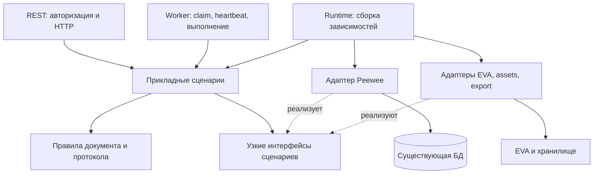

# Проект переработки BusinessDocumentService

Статус: архитектура реализована в рабочем дереве по активной цели «спроектируй детально архитектуру, алгоритмы и делай». Дата: 26.09.2026.

Исходный BusinessDocumentService удалён. Чтение, команды, завершение заданий, общий apply, создание/удаление, изменение роли и EVA имеют прикладных владельцев; детерминированные правила находятся в domain. REST и worker используют явную сборку runtime. Подробные контракты и алгоритмы приведены ниже, результаты проверки и пределы доказательств — в разделе 9.

## 1. Решение и границы

Логика исходного `BusinessDocumentService` разделена по владельцам сценариев: команды, завершение заданий, создание/удаление документов, EVA и чтение. Бизнес-решения вычислять чистыми функциями из загруженных значений. Транзакции организовывать в прикладных сценариях через узкие интерфейсы; SQL, внешние клиенты и загрузку файлов реализовать в адаптерах. REST и worker должны вызывать одни и те же сценарии изменения документа.

Цель — уменьшить количество независимых реализаций правил и повторного I/O. Число строк само по себе не является критерием готовности. Разделение на микросервисы, новую очередь, собственный фреймворк команд или изменение upstream-структуры не требуется.

Пользовательский сценарий: автор создаёт документ либо импортирует подходящую страницу EVA, отвечает на вопросы, принимает решения и добавляет замечания, получает анализ, проверяет подготовленные изменения и публикует согласованную редакцию. Модератор действует в пределах своей роли. Сбой, повтор запроса или потеря задания не должны порождать лишнюю редакцию либо потерю решения автора.

Критерии результата:

- Сохранены маршруты, JSON-ответы, коды ошибок, порядок элементов и форматы сохранённых событий/заданий.
- Доступность действия в ответе и разрешение его исполнения используют общие правила.
- SQL внутри обхода документов, источников плана и оснований редакций устранён.
- Повтор команды, откат отказа, версия документа и актуальность lease проверяются как прежде.
- В `business_documents/domain` и `business_documents/application` нет зависимостей от Peewee, `api.apps`, Quart, bootstrap и конкретных сетевых клиентов.
- После переключения потребителей остаётся одна реализация; старый класс не сохраняется как постоянный фасад.

Источник: ветка `main`, HEAD `a99d1748a0c25e249fba30b21c6a7816d65de78a` плюс существующие незакоммиченные изменения. Файл относится к локальному расширению: добавлен коммитом `0e0a676d6e9043d72af008297ba428207c8ca270` «feat: add governed business requirements workflow» от 26.08.2026. Исходный снимок до выделения логики: `d1a7fd286bae3b042a1e9f48f08a3f175238de43`; версия самого service.py в этих двух коммитах одинакова.

| Снимок service.py | Строк | Методов класса |
|---|---:|---:|
| HEAD | 3221 | 96 |
| Рабочее дерево после завершения перехода | Файл удалён | 0 |

SHA-256 файла из Git HEAD: `7bc0ef80a750df0802d23318ee20083da235b97147442ae0866de243d43207a0`.
Окончательный снимок изменённых исходников и тестов записан вместе с проверками вне checkout; исходный класс и постоянный фасад отсутствуют.
Строки посчитаны по тексту, методы — по AST тела класса; вложенные функции и функции уровня модуля в число методов не включены. Ссылки относятся к рабочему дереву. Ограничения его проверки приведены в разделе 9.

## 2. Что именно усложнено

| Участок | Проблема и решение |
|---|---|
| [Команды](S:/ragflow/business_documents/application/commands.py:90) и [правила действий](S:/ragflow/business_documents/domain/workflow.py:95) | Прикладной dispatch вызывает чистый command_problem; список действий проходит ту же проверку. Порядок ошибок и предпочтения UI проверяются отдельно. |
| [Применение изменений](S:/ragflow/business_documents/application/change_application.py:32) | Прежний метод объединял протокол, preview, no-op, AST и SQL. Уже выделен общий сценарий: один ReviewState, одна сборка AST, запись через writer в транзакции вызывающего кода. |
| [Пакет анализа](S:/ragflow/business_documents/application/job_completion.py:49) | В существующем diff повторные SELECT вопросов/ответов/предложений заменены индексами. В проекте закреплены первая запись при дубле, unique constraints и savepoint. |
| [SnapshotIndex](S:/ragflow/business_documents/domain/job.py:9) | Повторное построение разрешённых event/evidence IDs заменено одним индексом на результат. |
| [EVA pull](S:/ragflow/business_documents/application/eva_sync.py) | Импорт, проверка и pull используют публичное чтение через EvaPageSource. Дублирующего клиента, HTML-конвертации и расчёта remote hash в сценарии нет. |
| [Команда](S:/ragflow/business_documents/application/commands.py:95), [complete/fail](S:/ragflow/business_documents/application/job_completion.py:128) | Оба сценария получают значения и интерфейс транзакции. Сохранены ledger/savepoint, блокировка document → job и final lease fence; устаревшие методы удалены, потребители переключены. |
| [Пакетное чтение](S:/ragflow/api/apps/business_documents/adapters/queries.py:153) | В рабочем diff есть пакетный reader. Закрепить бюджеты запросов, восстановление старых авторов/EVA и отдельный query-сценарий. |
| [Родительский пакет API](S:/ragflow/api/apps/__init__.py:41) | Импорт запускает bootstrap. Чистые правила и сценарии находятся в верхнем пакете business_documents; runtime собирает адаптеры. |
| [Нормализация AST](S:/ragflow/business_documents/domain/content.py:215) | Вместо повторного обхода потомков для каждого пустого родителя построен индекс первых содержательных блоков по предку и типу. Сохранён порядок выбора. Membership использует множество, AST копируется один раз; отдельно копируется наследуемый блок. |
| [Ветка EVA без изменений](S:/ragflow/business_documents/application/eva_sync.py) | Решение NoChange принимается после повторной проверки владельца, версии, состояния и binding под общей блокировкой. Смена владельца/комментарий/rebind во время сети проверены на независимых PostgreSQL-соединениях. |
| [Классификация конфликта создания](S:/ragflow/api/apps/business_documents/adapters/persistence.py:96) | Широкий catch из исходного service уже заменён обработкой у конкретной вставки. Сохранять эту границу: проверять конкурирующий title/chat/page key после rollback savepoint, остальные IntegrityError пробрасывать. |
| [Занятость страниц EVA](S:/ragflow/business_documents/application/documents.py:187) | Исходный код уже читал пакетно; это не N+1. Текущий вариант считает ключи один раз и получает владельца с названием одним LEFT JOIN вместо двух SELECT. Не загружать весь JSON binding ради двух ключей. |
| [Удаление](S:/ragflow/business_documents/application/documents.py:258) | Уже убрана дублирующая предварительная загрузка документа. Роль проверяется до транзакции, состояние и активные задания — один раз под блокировкой; cleanup stages переживают удаление. |

В рабочем дереве уже есть `ReviewState`, чистая проверка источников плана, `PreviewSources`, проверка UTF-16-якоря, часть правил доступа и пакетное чтение. `domain/eva_binding.py` подключён через reader. Их нужно использовать в новых владельцах сценариев. В имеющемся diff `EvaDocumentPulled` уже делает анализ неактуальным и для прямой команды; это устранённый пример расхождения правил, а не дефект текущего снимка.

Не вся сложность лишняя. Вложенная транзакция для отказа команды, lease fence, восстановление экспорта и поддержка сохранённых старых данных выражают реальные требования. Их нельзя убирать ради короткого метода.

Ранний EVA NoChange исправлен и проверен гонками. Ошибки целостности создания, откаты удаления и смена роли также входят в прошедший PostgreSQL-профиль. Точные результаты и ограничения приведены в разделе 9.

## 3. Целевая структура и направление зависимостей



Все блоки, кроме внешних систем, остаются внутри существующего приложения. Интерфейсы принадлежат использующему их сценарию. Не нужен универсальный `Repository[T]`, общий bus либо каталог плагинов.

Основные владельцы в текущем дереве:

```text
business_documents/
  domain/
    access.py             # роли и разрешения
    workflow.py           # состояния и предварительные условия действий
    review.py             # факты цикла, активные источники, актуальность анализа
    change_plan.py        # разрешение источников и решение по плану
    assessment.py         # вопросы, предложения, dispositions и дедупликация
    content.py            # детерминированные операции AST, hash и rendering
    comment_anchor.py     # привязка комментария к UTF-16-выделению
    eva_binding.py        # восстановление значения привязки из событий
    errors.py             # ошибки правил без HTTP-объектов
  application/
    commands.py           # команда, replay, savepoint, задание
    job_completion.py     # complete/fail с единым алгоритмом фиксации
    change_application.py # общий apply для worker и подтверждения preview
    documents.py          # создание, импорт, удаление
    eva_sync.py           # pull, rebind, создание запроса публикации
    queries.py            # список, карточка, редакции, preview
    access.py             # изменение роли пользователя администратором
    assign_document.py    # существующий владелец смены автора
api/apps/business_documents/
  runtime.py              # явная сборка сценариев с адаптерами
  adapters/
    persistence.py        # транзакции, блокировки, CAS и атомарные записи
    queries.py            # пакетное чтение страниц и истории
    review.py             # загрузка значений для ReviewState
    eva.py                # граница к существующему EVA-сервису
    access.py             # блокировка пользователя и запись роли
    cleanup.py            # очистка через существующий export recovery
    assignment.py         # существующая граница назначения автора
    storage.py            # существующая граница хранилища
  assets.py               # загрузка версионированных schemas/templates/prompts
  worker.py               # жизненный цикл исполнения задания
  exports.py              # существующий экспорт и восстановление
```

Это распределение ответственности, не требование создать пустой класс в каждом файле. Простые правила остаются функциями. `assessment.py` нужен из-за общего поведения intake/review/draft; отдельные классы для каждого типа вопроса не нужны.

`LifecycleState` и `CommandType` находятся в `domain/workflow.py`; строки перечислений сохранены. Приватный `_CommandEnvelope` находится в [application/commands.py](S:/ragflow/business_documents/application/commands.py:59) и получает проверку схемы через DocumentContent. Старый API contracts-модуль удалён, прямые потребители перечислений переведены на domain. Чистый импорт сценариев проверяется без подстановки API bootstrap.

`domain/content.py` получает шаблон и схему как значения. Нормализация, импорт markdown, валидация, применение плана и рендеринг реализованы там. Assets-адаптер загружает версионированные файлы и переводит RuleViolation в прежний ValidationError 422; в нём нет второго алгоритма обработки AST. Чистые section_hash, render_section_text и привязка хешей используются потребителями напрямую из domain. Форматы схем, пути assets и способ публикации шаблона сохранены; чистые модули не импортируют `assets.py` из API.

### Минимальные контракты границ

| Граница | Необходимые операции | Что возвращает |
|---|---|---|
| Транзакция документа | lock document; savepoint; CAS; append event; insert revision/job; load/store command receipt | Простые значения документа, результата и событий |
| Завершение задания | lock document → job; load result context; fenced complete/fail | Значения job, lease и исходной версии |
| Чтение | load page; load document view; load revision history; load review inputs | Наборы записей без lazy ORM-связей |
| EVA | найти совпадения; прочитать страницу; проверить доступность привязки; создать запрос публикации | Нормализованный снимок/решение о привязке |
| Assets | загрузить закреплённые шаблон, policy, schema, prompt descriptor | Неизменяемые значения с версией |
| Export | проверить подготовленный результат; зафиксировать метаданные в текущей транзакции; поставить очистку; выполнить очистку | Значения артефакта и durable stage |

ID и часы передаются как функции. Для lease/TTL используется та же шкала времени, что у текущих worker и БД. Конкретные классы ORM не пересекают границу интерфейса, включая косвенную передачу в `PreparedExport` и export commit.

Транзакция открывается ровно на уровне публичного изменяющего сценария. `change_application` получает уже открытый transaction context и не делает самостоятельный commit: при потере lease его записи должны откатиться вместе с job. Для команды этот же код работает внутри command savepoint. Это общий владелец одного поведения с двумя реальными потребителями.

Минимальный смысл значений на границах:

| Значение | Существенные поля / правила |
|---|---|
| DocumentState | ID, tenant, owner, lifecycle, operation, state_version, revision ID, review cycle, pinned template/policy |
| JobContext | Job ID/type, source_state_version, base revision, неизменяемый payload, lease owner/token/expiry; документ заблокирован раньше job |
| ReviewState | Уже существующие индексы протокола; используются только в рамках загруженной версии |
| SnapshotIndex | Разрешённые event IDs, evidence refs и section IDs; один экземпляр на результат задания, без SQL |
| ChangeDecision | Вид результата, следующий lifecycle, упорядоченные основания/acknowledgements; новый AST только для ApplyRevision/проверки Prepared |
| EvaSnapshot | Идентичность connector/page, remote version/hash, нормализованный текст; без клиента и credentials |

Эта таблица задаёт контракт значений, а не обязательные новые публичные классы. Для внутренних записей допустимы типизированные mappings; классы нужны там, где они закрепляют инвариант. Интерфейсы содержат только операции используемых сценариев, без универсальных `get/save/query` над произвольными таблицами.

Ошибки доменных правил содержат `code`, `message`, `details`. Прикладные ошибки сохраняют существующие статусы 403/404/409/422 как часть формата ответов и ledger; их определение находится в чистом `application/errors.py`, без зависимости от API и Quart. В ledger сохраняется прежний сериализованный ответ, включая статус отказа: replay не должен пересчитывать исторический отказ по новым правилам. Преобразование записи ledger — ответственность его адаптера, а не доменного кода.

Распределение существующих публичных операций:

| Операции service.py | Новый владелец |
|---|---|
| create_document, delete_document | application/documents |
| execute_command | application/commands |
| complete_job, fail_job | application/job_completion |
| pull_from_eva, check_eva_update, rebind_eva, create_eva_change_from_revision | application/eva_sync |
| get_document, list_documents, list_catalog, list_revisions, get_revision, list_jobs, get_change_preview, list_access_users | application/queries |
| update_user_access_role | application/access |
| model_tables | Список моделей в адаптере persistence для проверенных bootstrap/test-потребителей; это не бизнес-API |

Изменение роли остаётся доступным только подтверждённому администратору. Запись роли ADMIN запрещена: она определяется `is_superuser`; изменение роли superuser через этот сценарий возвращает прежний конфликт. Выдача списка активных пользователей сохраняет проверку права назначения владельца.

## 4. Упрощённые алгоритмы

### 4.1. Контекст ревью один раз на версию

Вход: документ, цикл, вопросы, ответы, предложения, решения, комментарии и события в порядке `sequence`. Выход: открытые вопросы, ожидающие решения предложения, активные источники, актуальные assessments и dispositions, индексы для проекции. Побочных эффектов нет.

1. Построить карты сущностей по ID, ответов по question ID и решений по proposal ID.
2. Одним проходом по событиям собрать ссылки на сущности, последние assessments, разрешённые ранее источники и последний EVA pull.
3. Ограничить входы текущим циклом; оставить только последний применимый EVA pull.
4. Вычесть уже использованные либо подтверждённые как не требующие изменений входы.
5. Рассчитать открытые вопросы, ожидающие решения предложения и актуальность анализа.

Для `H` событий и `N` записей текущего цикла время `O(H + N)`, дополнительная память `O(H + N)` ссылок/индексов. Загрузчик фильтрует вопросы, предложения и комментарии по циклу, ответы и решения — через подзапрос к соответствующим сущностям этого цикла. Это шесть SELECT без списка SQL-параметров на каждый ID. Payload события не копируется в каждую карту. Реальный объём памяти зависит также от размера JSON/markdown.

Полная лента событий сохраняется: она нужна неизменяемому снимку и различению неизвестного, неподходящего и устаревшего источника. Отсутствие тела сущности старого цикла не меняет результат: вопрос/предложение отклоняется по циклу до проверки раздела; комментарий — по актуальному disposition. Эквивалентность кодов, сообщений и details, протокола и доступных команд проверяется на старых и текущих источниках в SQLite и PostgreSQL. Это сокращение загрузки тел сущностей, а не заявление о постоянной стоимости всей истории.

Контекст живёт в одной операции чтения либо транзакции и соответствует определённому `state_version`. После записи его нельзя повторно использовать как актуальный без обновления фактов. Для лёгких команд, которым не нужен весь протокол, reader загружает только нужные записи; общий контекст не становится обязательным глобальным объектом.

Snapshot задания сохраняет прежние `source_events`, формат протокола, AST, Markdown для retrieval, hashes и provenance. Новые задания не содержат производный `current_revision.section_texts`: это представление для UI, которое AI-адаптер и раньше удалял перед вызовом модели. Отдельная проекция revision_snapshot не вычисляет эти тексты; HTTP-редакция по-прежнему их содержит. Сохранённые задания продолжают читаться, миграция и новый schema_version не требуются. Тест сравнивает полный input_payload модели до и после исключения поля. Preview использует отдельное scoped-чтение AST редакции, без загрузки истории, авторов и оснований.

### 4.2. Один владелец предварительных условий команды

Текущий интерфейс:

```python
command_problem(command, document, review, payload=None, *, preview=None)
available_commands(document, review, *, preview=None)
```

Оба входа принадлежат `domain/workflow.py` и используют общие предикаты состояния. `command_problem` возвращает первую ошибку состояния/payload в порядке конкретной команды; единой фазы «все проверки состояния раньше всех проверок payload» не будет — она изменила бы приоритет существующих ошибок. При отсутствии payload проверяется допустимость по состоянию для UI. Конкретный ответ, предложение или комментарий проверяются после общей проверки состояния. Исполнение дополнительно проверяет права, envelope и версию в прикладном сценарии. Список действий в ответе не заменяет серверную проверку.

Для 13 фиксированных команд достаточно явного `match`/набора приватных функций. Реестр обработчиков, фабрика команд и универсальный интерпретатор правил здесь не нужны. Таблица ниже служит спецификацией, а не новой конфигурацией runtime.

Важно сохранить существующее различие: при полном intake-анализе UI предлагает создание черновика, хотя прямой запрос повторного анализа может быть допустим. Поэтому нельзя просто запретить всё, чего нет в `allowed_commands`. Условия состояния общие, правила отображения явные; инвариант — каждое отображённое действие допустимо по состоянию, но payload ещё может оказаться некорректным.

Основные условия:

| Действие | Условия |
|---|---|
| REQUEST_INTAKE_ASSESSMENT | INTAKE; покой; нет открытых intake-вопросов; повтор уже завершённого анализа допустим |
| REQUEST_DRAFT | INTAKE; покой; нет редакции и открытых intake-вопросов; последний применимый анализ COMPLETE и новее ответов |
| REQUEST_REVIEW_ASSESSMENT | REVIEW; покой; при открытых вопросах требуется новый feedback после последнего анализа |
| ANSWER_QUESTION | Покой; вопрос принадлежит документу и текущим stage/cycle, ещё не отвечен; выбран ровно один допустимый способ ответа |
| DECIDE_PROPOSAL | REVIEW; покой; предложение текущего документа/цикла, без прежнего решения; ACCEPTED либо REJECTED |
| ADD_COMMENT | REVIEW; покой; текущая редакция, непустой текст, существующий раздел и корректный якорь, когда он требуется |
| APPLY_CHANGES / PREPARE_CHANGES | REVIEW; покой; текущая базовая редакция; нет открытых вопросов; актуальный COMPLETE-анализ; есть применимый вход, если остаются нерешённые предложения |
| CONFIRM / DISCARD | REVIEW и IDLE; актуальный preview для того же job/revision/cycle/version; TTL не истёк |
| REQUEST_EXPORT | AGREED; покой; текущая согласованная редакция; поддерживаемый формат |
| START_REVIEW | AGREED; покой; новый цикл |
| ARCHIVE | Документ ещё не архивирован; покой |

Новый ответ, решение, комментарий или `EvaDocumentPulled` делает прежний review-анализ неактуальным. Берётся последний анализ, даже если он `NEEDS_INPUT`; поиск более старого `COMPLETE` недопустим. Сохраняются порядок проверок и детали ошибок при нескольких одновременных нарушениях.

### 4.3. План изменений через явные множества

Вход: схема-проверенный план, актуальный контекст, неизменяемый snapshot задания, evidence snapshot и базовый AST. Выход: разрешённые операции, основания в исходном порядке, acknowledgements и следующий lifecycle. Проверка не выполняет SQL.

Обозначения:

- `A` — активные входы текущего цикла после исключения уже разрешённых.
- `U` — входы, используемые операциями.
- `Z` — входы, явно отмеченные как не требующие изменений.
- `P` — активные принятые предложения.

Условия: `U ⊆ A`, `Z ⊆ A`, `U ∩ Z = ∅`, `A = U ∪ Z`, `P ⊆ U`.

Один вход может обосновывать несколько операций. Поэтому это не взаимно однозначное распределение входов по операциям. Множества используются для проверки, а отдельные списки сохраняют порядок ссылок и предусмотренные контрактом повторения.

```text
snapshot_ids, evidence_ids := индексы, построенные один раз
для каждой операции в исходном порядке:
    проверить наличие source_event_ids и членство в snapshot
    проверить evidence refs
    проверить существование и допустимый тип события
    проверить принятое решение / CONFIRMED_CHANGE для комментария
    проверить документ, цикл, раздел и активность источника
    добавить ссылки в упорядоченный список оснований
проверить Z: активность, отсутствие пересечения с U, правила NO_CHANGE
проверить пропущенные принятые предложения, затем остальные пропуски
проверить уникальность целей, hashes разделов и полученный AST
вернуть решение
```

Для вопросов и предложений раздел источника ограничивает цель операции. Подтверждённый комментарий может обосновывать согласованные изменения нескольких разделов: его якорь не ограничивает весь смысл просьбы автора. Старый цикл, отклонённое предложение, уже использованный вход и ссылка вне snapshot отклоняются.

При `R` ссылках и `K` операциях успешная проверка после построения индексов занимает `O(R + K + |A|)`; формирование отсортированных списков ошибок имеет дополнительную стоимость сортировки. Копирование AST и rendering обходят контент; нормализация также сортирует разделы за `O(S log S)`. Исключение SQL не устраняет эту работу.

Прикладной ApplyChanges принимает один ChangeMode: APPLY, PREVIEW или CONFIRM. Независимых флагов, допускающих одновременно preview и confirmation, нет. Сохранённый job payload.preview_only остаётся прежним внешним признаком и переводится в режим на границе завершения задания.

После проверки выбирается один результат:

| Результат | Изменения состояния |
|---|---|
| Prepared | Проверить возможность применения, сохранить preview; вернуть operation в IDLE; новую редакцию не создавать |
| NoChange | Записать acknowledgements и событие; редакцию не дублировать |
| ApplyRevision | Применить операции, проверить шаблон, создать одну неизменяемую редакцию и событие |

После NoChange/ApplyRevision lifecycle остаётся REVIEW, если есть нерешённые предложения; иначе становится AGREED. При подтверждении preview повторяются проверки актуальности версии, цикла, редакции, TTL и источников. Worker и команда подтверждения вызывают один алгоритм решения по плану.

### 4.4. Пакетное чтение списка и истории

Для списка: прочитать `count` и страницу, собрать ID владельцев/редакций/документов, затем отдельными пакетными запросами получить пользователей, текущие редакции, привязки EVA и последнее задание каждого документа. Последнее задание выбирается в БД, а не загрузкой всей истории заданий в Python.

Если материализованной EVA-привязки нет, одним дополнительным запросом получить необходимые события для таких документов: первое создание, последнее разрешение привязки, последний pull. Восстановить значение чистой функцией, сохранив правило «pull учитывается после последнего разрешения». Не читать полную историю каждого документа ради URL.

Бюджет для страницы до 100 записей: **не более 7 SELECT**, включая fallback, без зависимости количества запросов от числа строк. Выборка пустой страницы может пропускать ненужные запросы. SQL-план всё равно нужно проверить: постоянное число round trips не означает постоянное время.

В исходном HEAD порядок списка — `update_time DESC`, заданий — `create_time DESC`; на равном времени он не определён. Текущий reader уже добавляет вторичный `id DESC`. Эту стабилизацию нельзя выдавать за побитовую эквивалентность недетерминированного случая. Составной индекс `(document_id, create_time)` для jobs добавляется только после EXPLAIN на используемых СУБД; сейчас модель содержит отдельный document ID и индекс `(status, available_at)`.

Preview читает document, актуальное job и scoped revision: три SELECT. История и авторы для этой операции не загружаются.

Для истории редакций: прочитать редакции один раз; объединить source IDs; пакетно прочитать события и связанные сущности; один раз построить карту `revision_id → author`; последним запросом получить всех пользователей. Собирать `change_basis` в сохранённом порядке source IDs. Старые данные с отсутствующим `author_id` должны продолжать восстанавливаться из событий/заданий.

Запросы на историю зависят от числа типов данных и необходимых порций `IN`, а не выполняются на каждый source ID. При больших историях адаптер разбивает `IN` по лимитам драйвера. Нельзя обещать константное время для API, возвращающего полную историю: объём ответа остаётся линейным по истории.

### 4.5. Дедупликация анализа и preview

Для пакета анализа один раз загрузить существующие ключи вопросов `(stage, cycle, canonical_tag)`, предложений `(cycle, fingerprint, source_scope_hash)` и отвеченные question IDs. Обходить новые элементы в исходном порядке; при первом новом элементе добавлять его ID в индекс сразу. Повтор внутри того же пакета и повтор уже сохранённого элемента находят одну запись.

Сохраняются NFKC/casefold-нормализация, отдельная область источников предложения, первая запись для одинакового ключа, привязка NEEDS_QUESTION только к открытому вопросу и счётчики фактически вставленных элементов. Уникальность в БД остаётся последним арбитром. Вложенные savepoint вокруг конфликтующей вставки нельзя убрать до доказательства, что все писатели сериализованы одной блокировкой документа; случайный IntegrityError не превращается в «дубликат».

Порядок обработки review assessment:

```text
проверить состояние задания и схему review_plan
загрузить существующие questions/answers/proposals и комментарии цикла
построить section_ids, snapshot_ids, evidence_refs и индексы дедупликации
проверить dispositions: дубли → полнота → связи NEEDS_QUESTION
для каждого вопроса в исходном порядке:
    проверить evidence и нормализовать вопрос чистой функцией
    найти прежний ID по (stage, cycle, canonical_tag)
    если ключ новый: вставить вопрос и сразу добавить ID в индекс
    запомнить первый ID для тега
дополнить dispositions найденными ID; проверить их по answered_question_ids
для каждого предложения в исходном порядке:
    проверить snapshot/evidence и нормализовать предложение
    найти либо вставить по (cycle, fingerprint, source_scope_hash)
вычислить outcome по текущим вопросам и answered_question_ids
CAS документа + одно событие ReviewAssessed
```

Для dispositions используются **все комментарии текущего цикла**, включая ранее разрешённые. Это не то же множество, что активные входы плана изменений после вычитания resolved. Сведение двух множеств в одно молча изменило бы контракт анализа комментариев.

До выделения сценария выполнялся отдельный SELECT для каждого вопроса/предложения и до трёх дополнительных проверок на каждый NEEDS_QUESTION. После загрузки индексов такие SELECT внутри циклов исчезают; записи новых сущностей остаются линейными по их количеству. Это сокращение чтений, а не обещание одной SQL-команды на весь результат. Редкий конфликт уникальности разрешается в адаптере по точному ключу с сохранением savepoint.

Для `K` предложений и `H` событий повторное построение snapshot-индекса даёт `O(K·H + R)`; один индекс даёт `O(H + K + R)`. Тот же приём применяется к описаниям источников preview. В текущем diff `PreviewSources` уже строит карты один раз.

Якорь комментария: текст раздела кодировать в UTF-16 один раз, затем проверять смещения, выделение и контекст. Сохраняются запрет разрыва surrogate pair, окно контекста в 64 UTF-16 units и привязка к точной редакции. Эта часть уже выделена в рабочем diff. Переход на индексы Python Unicode изменил бы браузерный контракт.

### 4.6. Порядок проверок и ошибок

Сначала сохраняются общие границы `envelope → доступ → replay → expected_state_version → archived`. Далее проверки идут в нынешнем порядке конкретной команды. Примеры, которые нельзя заменить единым глобальным порядком:

| Команда | Порядок после общих проверок |
|---|---|
| REQUEST_INTAKE_ASSESSMENT | открытые intake-вопросы → покой → INTAKE |
| REQUEST_REVIEW_ASSESSMENT | REVIEW → открытые вопросы без нового feedback → покой |
| REQUEST_DRAFT | INTAKE → уже есть редакция → открытые вопросы → актуальный COMPLETE → покой |
| APPLY_CHANGES | REVIEW → существующий preview → открытые вопросы → актуальный COMPLETE → base revision → pending proposals без активного входа → покой |
| PREPARE_CHANGES | Как APPLY_CHANGES, но без запрета из-за существующего preview |
| CONFIRM / DISCARD | REVIEW → покой → актуальность конкретного preview; для CONFIRM затем полный общий алгоритм плана |
| REQUEST_EXPORT | AGREED → текущая согласованная редакция → допустимый формат → покой |
| ANSWER_QUESTION | покой → существование вопроса в документе → stage/cycle → прежний ответ → допустимость ответа |

«Покой» для обычной команды включает IDLE и FAILED. Актуальный preview требует именно IDLE, а также тот же cycle/revision и отношение `job.source_state_version == document.state_version - 1`. Уравнивание этих условий расширило бы допустимость preview.

Тесты на два одновременно нарушенных условия фиксируют код, details и статус первой ошибки. Общие предикаты не должны менять этот порядок. Неожиданную ошибку SQL нельзя переводить в бизнес-отказ или успех дедупликации.

### 4.7. Нормализация и применение AST

Вход: AST и закреплённый опубликованный шаблон. Выход: самостоятельный нормализованный AST с прежним порядком разделов и блоков. Входной объект не изменяется. Неверные структуры должны оставаться доступными последующей валидации, а не исчезать при «очистке».

Исходный normalize_document_ast делал глубокие копии разделов, всего документа и снова выбранных разделов. Для каждого пустого обязательного раздела `next(...)` заново перебирал flattened_sections и блоки подходящих потомков. Если `T` — число разделов шаблона, `S` — число входных разделов, `B` — число блоков, верхняя оценка поиска — `O(T·(S+B))`; отдельно membership в списке expected_ids стоил `O(S·T)`. При фиксированном маленьком шаблоне это не доказательство квадратичного роста по размеру документа; измерения приведены в разделе 9.

Реализованный алгоритм:

```text
создать одну собственную копию AST
развернуть вложенные разделы с прежним порядком «вложенные, затем родитель»
проверить дубли ID; сохранить нынешний путь ошибки для невалидного входа
построить by_id и множество template_ids
для каждого раздела в исходном порядке:
    найти первый содержательный блок каждого типа и его позицию
    для каждого предка ID сохранить первый такой блок, не перезаписывая найденный
для каждого раздела шаблона:
    взять имеющийся раздел или восстановить пустой
    если обязательный раздел пуст:
        среди разрешённых типов взять блок с наименьшей исходной позицией
        скопировать этот блок, чтобы родитель не разделял mutable объект с потомком
    убрать служебные поля шаблона
добавить прочие разделы; применить прежнюю стабильную сортировку
проверить схему, outline, типы блоков и требования к диаграммам
```

При глубине ID `D` и числе поддержанных типов блоков `Q` индекс строится за `O(B + S·D·Q)`, выбор наследуемого блока — `O(T·Q)`. К этому добавляются копирование объёма контента и прежняя сортировка `O(S log S)`. `Q` — небольшой фиксированный набор типов, а не новая расширяемая система. Индекс хранит ссылки и позиции; память и число копий нужно сравнить на тех же документах. Порядок «первый подходящий потомок, первый его подходящий блок» сохраняется через позиции, а не через перебор множества типов.

apply_change_plan использует карту section ID и множество посещённых целей. Поля заменяются на неглубоких копиях разделов, а normalize делает одну глубокую копию окончательного AST, включая blocks/evidence_refs из операций. Если для неканонических сохранённых данных normalize вернул входной объект, результат отдельно копируется для сохранения независимости. Эта ветвь не добавляет режимы в публичный API. Дополнительный framework для операций не нужен: поддерживается одна операция замены. Сохранить порядок `дубль цели → неизвестный раздел → hash conflict`, один результат AST и одну финальную валидацию. Hash вычисляется по прежнему каноническому JSON; замена на hash от отображаемого текста недопустима.

Чистые normalize/validate/apply/render располагаются в domain/content.py и получают шаблон/схему как значения. Assets-адаптер загружает файлы по прежним путям; runtime подаёт эту границу сценариям. Второго алгоритма AST в API нет. Проверки эквивалентности: вложенные разделы, несколько подходящих потомков, разные allowed_blocks у предков, пропущенные optional, дубли/невалидные ID, неизменность входа и отсутствие aliasing родителя с потомком. Выбор первой ошибки схемы использует min по прежнему пути вместо сортировки всех ошибок; при равных ключах сохраняется первая ошибка исходного порядка.

### 4.8. EVA: одно чтение, два этапа проверки

Import/check/pull используют одно публичное read_connected_page через EvaPageSource. EVA-адаптер возвращает нормализованный снимок: идентичность страницы, version, hash и markdown. Общий путь чтения реализуется поверх существующего EVA-компонента; выбор credentials и правила внешнего доступа остаются у него. Не создавать второй EVA-клиент.

Для операции над уже выбранной страницей:

```text
проверить запрос, доступ, expected_version, состояние и capability
запомнить ID/версию документа и идентичность binding
прочитать EVA вне транзакции; проверить пустоту и предел 100000 символов
transaction:
    заблокировать документ тем же способом, что commands/assignment/delete
    повторно проверить доступ, expected_version, состояние и binding
    загрузить текущую редакцию и вычислить решение pull
    если NoChange: вернуть актуальное состояние без события и увеличения версии
    иначе: CAS + EvaDocumentPulled + binding в одной транзакции
```

Решение NoChange сохраняет точный предикат: `last_pulled_hash == remote_hash` и либо pull ожидает применения в текущем REVIEW-цикле, либо его event ID уже вошёл в source_event_ids текущей редакции. Одного равенства hash недостаточно. Предикат оценивается **после** повторной проверки. Ранний возврат исходного service удалён: конкурентное изменение владельца/документа возвращает 403/409 в соответствии с актуальным доступом и версией. Это намеренное исправление конкурентного случая, закреплённое SQLite- и PostgreSQL-проверками.

Не смешивать виды операций: check только сообщает свежесть; rebind заменяет проверенную привязку и сохраняет событие; pull создаёт вход ревью; create_eva_change_from_revision открывает существующее согласование публикации. Автоматическая публикация или изменение локальной редакции при pull в эту архитектуру не входят. При объединении чтения проверить различия сообщений ошибок и обновления page_url у нынешних import/check/pull; механическая замена вызова не доказывает эквивалентность.

Занятость совпадений уже читается пакетно в CreateDocument._matches_with_occupancy: это не N+1. Канонические ключи вычисляются один раз; binding_occupancy получает привязки и названия документов одним LEFT JOIN, затем сценарий восстанавливает результат в исходном порядке. Сохранены приоритет identity key над URL key, поведение отсутствующего документа и алгоритм hash ключей. Для пустого списка SQL не нужен. При N совпадениях работа Python и память — O(N), SQL — один запрос в пределах лимита параметров драйвера. Для произвольно большого входа потребуются порции; текущие тесты на 1/10/100 совпадений не доказывают поддержку неограниченного N. Изменение нормализации ключей потребовало бы миграции сохранённых уникальных значений.

### 4.9. Точная граница оставшихся EVA-сценариев

В `application/eva_sync.py` находится один владелец четырёх явно именованных операций. Отдельный класс на каждый HTTP-маршрут не требуется. Решение о NoChange вычисляется из значений документа, binding и source IDs редакции; его вычисляет приватная чистая функция _pull_is_current без нового слоя.

| Операция | Вход и результат | Проверки и побочные эффекты |
|---|---|---|
| pull | ActorAccess, document ID, expected version → document + sync | Права редактирования; IDLE/FAILED; AGREED/REVIEW и редакция; PULL_FROM_EVA. Сеть вне транзакции. Под lock повторить проверки, затем NoChange либо атомарные CAS/event/binding. |
| check | ActorAccess, document ID → changed, remote/baseline version, can_pull | Сохранить общий читаемый каталог и доступ к EVA-коннектору. Ни события, ни изменения binding/версии. can_pull сохраняет нынешний смысл доступности по роли, редакции и lifecycle; это не разрешение обойти проверки pull. |
| rebind | ActorAccess, document ID, expected version → document | Покой, не ARCHIVED, binding существует. Resolve вне транзакции; нужен CONNECTED. Под lock повторно проверить права, версию и исходный page_url; CAS + EvaBindingResolved + замена binding. |
| create_change | ActorAccess, tenant инициатора, document ID, expected version → существующий EVA change | Покой, AGREED, текущая редакция, CREATE_EVA_CHANGE. Передать immutable markdown и до трёх summary оснований; общий summary ограничен 50000 символов. Открыть существующее согласование, не публиковать страницу. |

Граница чтения EVA возвращает значения: `connector_id`, remote document identity, remote version/hash, markdown и обновлённые метаданные страницы. Она реализована через `EvaPageSource.read_connected_page`; создание change делегируется публичному `EvaDocumentChangeService.create_change`. Application не импортирует этот конкретный сервис и не знает credentials/Connector.

Нельзя целиком записывать refreshed binding из чтения при pull: нынешний pull меняет remote version/hash и last-pull поля, а read_connected_page дополнительно обновляет page_url, project/name и capabilities. Перечень записываемых полей остаётся явным. Сохранить прежние code/message/details ошибок; например, сообщение пустой страницы сейчас отличается у pull и import. Преобразование различий принадлежит узкому EVA-адаптеру, без второй HTML-конвертации и второго клиента.

Для атомарной части используются существующие lock_document, update_document, append_event и store_binding. Binding и редакцию читает тот же PeeweeDocumentReader на соединении текущей транзакции; новый writer для EVA не создаётся. Запрос редакции должен быть ограничен document ID, чтобы повреждённая ссылка не давала чужой контент. Значения возвращаются без ORM-объектов. Одна прикладная транзакция владеет всеми записями, адаптер не делает самостоятельный commit.

Псевдокод чистого решения:

```text
pending := lifecycle == REVIEW and last_pull_cycle == active_cycle
consumed := last_pull_event_id входит в source_event_ids текущей редакции
if last_pulled_hash == remote_hash and (pending or consumed):
    return NoChange
next_cycle := active_cycle + 1, если AGREED, иначе active_cycle
return RecordPull(next_cycle, remote_version, remote_hash, markdown)
```

Выполнять его только после блокировки и повторной авторизации. Для NoChange не увеличивать state_version, не создавать event и не заменять revision. Для RecordPull — ровно один шаг версии и одно событие; локальная редакция остаётся базой анализа. После снятия блокировки другие запросы могут снова изменить документ: гарантия относится к состоянию в момент принятия решения, а не к вечной свежести ответа.

Наблюдение, требующее отдельного решения при реализации: create_change проверяет локальную версию до вызова другого компонента. Проект сохраняет публикацию проверенного снимка редакции; он не обещает атомарность с последующей сменой владельца или редакции. Если потребуется отменять такую отправку при конкурентном изменении, это отдельный контракт между двумя владельцами состояния, а не повод держать сетевой вызов внутри блокировки документа.

## 5. Транзакционные сценарии

### Команда пользователя

1. Проверить envelope и вычислить прежний канонический hash запроса.
2. Открыть транзакцию, заблокировать документ, проверить права текущего пользователя.
3. Искать ledger по tenant самого документа, document ID и idempotency key. Проверка доступа выполняется до выдачи replay.
4. При совпадении hash воспроизвести сохранённый результат; при отличии вернуть IDEMPOTENCY_CONFLICT.
5. В savepoint проверить expected version, правила состояния/payload и записать изменение.
6. При бизнес-отказе откатить весь savepoint; во внешней транзакции сохранить отказ. После её commit вернуть ту же ошибку.
7. При успехе сохранить ответ вместе с изменениями. Конфликт вставки ledger разрешать только через точный существующий ключ; прочие ошибки целостности пробрасывать.

После отката savepoint нельзя читать «текущее» состояние из уже изменённого in-memory ORM-объекта. Прикладной сценарий хранит исходное значение DocumentState и заменяет его результатом CAS только на успешном пути; отказ использует состояние после rollback. Fault injection после CAS проверяет, что ledger сохраняет именно откатившуюся версию и воспроизводит тот же отказ.

Смена владельца, удаление, queue/recovery и completion должны сохранять совместимый порядок блокировок. Внешний вызов к LLM, EVA или storage не входит в обычную транзакцию команды.

### Завершение и отказ задания

Worker отвечает за claim, heartbeat, retries и само выполнение. Прикладной сценарий отвечает за право результата изменить документ:

```text
transaction:
    найти document ID задания в нужном tenant
    заблокировать document, затем job
    обработать существующий COMPLETED / DEAD replay по прежним правилам
    проверить RUNNING, owner, token и expires_at
    проверить audit, затем source_state_version
    внутри нужной ветви проверить base revision и остальные условия
    вычислить и записать результат общего бизнес-алгоритма
    выполнить final UPDATE job с owner/token/status/expiry в WHERE
    если обновлена не одна строка — JOB_LEASE_LOST и rollback всего
```

Проверки lease в начале и при финальном UPDATE нужны обе. Истечение lease во время обработки не должно оставить зафиксированные редакцию, событие либо метаданные опубликованного артефакта. Уже загруженный staging blob удаляется существующим механизмом восстановления: откат SQL сам по себе не откатывает PUT. Нельзя переносить final UPDATE за пределы транзакции. Неизменяемый snapshot задания и pinned evidence сохраняются при retry.

### Создание документа

Владелец — application/documents.py. Сценарий использует узкие операции чтения каталога, проверки datasets, вставки документа/привязки/редакции и записи событий. Он не получает ORM User/Connector или concrete storage. Для создания нужны реальная граница с каталогом/датасетами и EVA; универсальный repository для всех таблиц не нужен.

1. Проверить роль и create-контракт v1/v2/v3 в нынешнем порядке; нормализовать title, разрешить каталог и версии шаблона/policy.
2. Проверить доступность datasets и совместимость embeddings. Предварительный поиск дубликата позволяет завершить запрос до дорогого чтения EVA, но не заменяет уникальный индекс БД.
3. Разрешить EVA-решение и прочитать содержимое вне транзакции. SKIP не запускает ни поиск, ни чтение. v2 сохраняет подтверждение замены; v3 автоматически выбирает только единственное свободное точное совпадение.
4. Подготовить и проверить импортируемый AST как значение; сеть и рендеринг не держат блокировку БД.
5. В одной транзакции проверить конкурирующее создание и записать документ, binding, DocumentCreated; при импорте — EvaDocumentImported и редакцию 1. Уникальные title/page/identity в БД остаются окончательной защитой от гонки.
6. При конфликте адаптер распознаёт точный unique key. Наличие binding само по себе не доказывает, что IntegrityError означает занятую страницу; неожиданная ошибка целостности должна завершить запрос без ложного бизнес-кода.

Состояния после успешного commit:

| Создание | Lifecycle / operation | Версия / цикл | Редакция |
|---|---|---|---|
| Без импорта, включая SKIP | INTAKE / IDLE | 1 / 0 | Отсутствует |
| v3 с валидной страницей | REVIEW / IDLE | 2 / 1 | Одна редакция № 1 с основанием EvaDocumentImported |

События сохраняют последовательность 1 и 2; не объединять их в новое событие ради уменьшения записей. Ошибка импорта не должна оставлять документ, событие или занятую привязку.

### EVA

Проверить доступ и исходную версию, прочитать удалённую страницу вне транзакции, нормализовать/проверить размер и hash. Перед записью заново проверить права, версию и идентичность привязки; затем выполнить CAS и записать событие/привязку атомарно. Повторно полученный тот же контент не создаёт новое изменение при выполнении текущих условий идемпотентности.

В REVIEW pull добавляет вход протокола; в AGREED начинает следующий review-цикл. Он не перезаписывает локальную редакцию. Новый документ schema v3 сохраняет правило автоматического импорта единственного свободного точного совпадения; неоднозначность, занятая страница и SKIP обрабатываются как сейчас.

### Экспорт и удаление

Сохранить существующие durable stages, reserve/prepare/read-back/commit и восстановление после прерывания PUT. Проверка результата и публикация метаданных должны разделять транзакцию фиксации задания. Нельзя заменить это простой последовательностью «загрузить blob, вставить artifact».

Удаление проверяет роль до транзакции, затем один раз загружает документ под блокировкой и проверяет состояние плюс активные задания. Дублировать незаблокированное предварительное чтение не нужно: оно не обеспечивает окончательного решения и не избегает дорогого внешнего I/O. Задачи очистки артефактов сохраняются до удаления метаданных; физическая очистка выполняется после commit и повторяется при сбое. Ошибка storage не должна уничтожать сведения, необходимые для повторной очистки.

При переносе SQL удаления адаптер получает один document ID, внутри той же транзакции ставит существующие durable stages на очистку и удаляет только принадлежащие документу строки в текущем порядке зависимостей. Stage не удаляется вместе с документом: он нужен после сбоя процесса. Прикладной сценарий получает stage IDs и количество артефактов, затем вызывает операции cleanup/reconcile. Конкретный storage передаётся адаптеру при сборке зависимостей, а не проходит через бизнес-сценарий.

PENDING/RUNNING/RETRY блокируют удаление даже при ошибочно сохранившемся IDLE. Ошибка записи stage откатывает удаление; ошибка физической очистки после commit оставляет stage для повторения. Сохранить смысл полей deleted_artifacts и storage_cleanup_failures; не выдавать постановку на очистку за завершённое удаление blob. Существующие механизмы export/recovery переиспользуются без новой очереди.

### Изменение роли

application/access.py проверяет подтверждённый is_admin, корректную роль и существование пользователя. ADMIN не записывается этим сценарием; superuser сохраняет отдельное управление. Чтение пользователя, проверка superuser и запись выполняются под одной блокировкой строки в транзакции; ошибка после UPDATE откатывает роль. Адаптер обновляет единственное поле роли и timestamps. Бизнес-правила берутся из domain/access.py; новая иерархия permission-сервисов не нужна. Назначение владельца остаётся в существующем assign_document.py и использует общий порядок блокировок документа.

## 6. Контракты и потребители

| Потребитель | Изменение при реализации | Сохраняемый контракт |
|---|---|---|
| [REST API](S:/ragflow/api/apps/restful_apis/business_document_api.py:30) | Получает сценарии из runtime вместо большого класса | Маршруты, auth, статусы и JSON |
| [Worker](S:/ragflow/api/apps/business_documents/worker.py:382) | Вызывает общий complete/fail | Claim/heartbeat/retry/cancellation и lease fence |
| [Назначение автора](S:/ragflow/api/apps/business_documents/adapters/assignment.py:157) | Читает итог через query-сценарий | Существующий AssignDocument, права и сериализация назначения |
| AI/evidence/export | Получают прежние бизнес-данные snapshot и версии; новый snapshot не рендерит UI section_texts | Одинаковый input_payload модели, Markdown для retrieval, audit, source refs, artifacts и чтение сохранённых jobs |
| Web | Не требует смены API | Список действий, preview, история, права, UTF-16-якоря |
| Тесты и golden harness | Используют нового владельца сценария; fault injection переносится на реальную границу | Все утверждения поведения сохраняются |

Общий читаемый каталог намеренный: нельзя добавлять фильтр `tenant_id == actor_id` к списку или чтению документа. Мутации зависят от владельца и роли, а ledger/job — от tenant документа. `ADMIN` в строковом поле роли без подтверждённого `is_admin` не повышает права.

При переносе проверить не только импорты: регистрации, сериализованные события/DSL, monkeypatch приватных методов в race/export-тестах и проверки архитектурных границ. Обновление теста не должно удалять сам fault point или ослаблять ожидаемый rollback.

Поддержка старого author/EVA binding — работающий путь чтения сохранённых данных. Удалять её можно только после отдельного доказательства полноты миграции. Переименование `legacy` или отсутствие свежих записей не является таким доказательством.

## 7. Выполненный переход

| Этап | Законченное изменение | Проверка выхода |
|---|---|---|
| 1. Закрепить поведение | Зафиксировать контракты и реальные причины каждого существующего fallback; учесть текущий diff | Матрица сценариев/ошибок, исходные query counts, исходные тесты |
| 2. Чистые решения | Довести review/workflow/change_plan/assessment/content; общие индексы snapshot | Чистые функции без I/O; одинаковые результаты и порядок ошибок; изолированные импорты |
| 3. Чтение | Пакетные список/история/карточка, один preview lookup | 1/10/20/100 строк, несколько владельцев, старые привязки/авторы, query budgets и память |
| 4. Команды | Перенести execute/replay/job request и мутации через интерфейс транзакции; подключить общий change_application для подтверждения preview | Успех/отказ/replay/конфликт; child writes полностью откатываются |
| 5. Завершение заданий | Перенести complete/fail и общий commit изменения | Worker, preview confirmation, потеря lease, export atomicity |
| 6. Документ и EVA | Перенести create/delete/sync; заменить обращения к приватным EVA-методам узким адаптером | v1/v2/v3, роли, дубли, гонки версии/привязки, очистка |
| 7. Переключить потребителей | REST, worker, assignment, tests; удалить заменённые методы и service.py | Нет старых импортов и двойных правил; полный профиль проверки Business Documents |

На каждом этапе старый метод удаляется после переключения всех его потребителей в одном согласованном изменении. Общий `change_application` подключён к worker и подтверждению preview; `_complete_changes` удалён. Command ledger и job completion находятся в отдельных прикладных владельцах и используют один persistence-адаптер. В финальном состоянии не должно быть старого класса, который только пересылает вызовы. Временные этапы не становятся второй production-реализацией.

## 8. Проверка и критерии приёмки

Обязательные группы примеров:

- Права: общий просмотр, свой/чужой документ, moderator/admin, запрет подмены роли, доступ к datasets, повтор после изменения доступа.
- Workflow: ответ после COMPLETE, новый EVA pull в том же цикле, NEEDS_INPUT после старого COMPLETE, частичный REVIEW и нерешённые предложения.
- План: неизвестный/чужой/устаревший источник, неверный цикл/раздел, принятый источник без операции, двойной disposition, повтор применения уже разрешённого источника, несколько операций от одного комментария.
- Контент: hashes разделов, повтор цели, закреплённый шаблон, no-op без новой редакции, UTF-16 и surrogate boundaries.
- Preview: актуальный/устаревший/чужой/истёкший, подтверждение дважды, конфликт с прямым APPLY_CHANGES.
- Транзакции: accepted/rejected replay, отличный payload под тем же ключом, CAS failure после дочерней вставки, конкурентные команды и удаление.
- Worker/export: stale version, lease recovery, token mismatch, expiry между началом и final UPDATE, сбой PUT и атомарная публикация artifact.
- Чтение: несколько владельцев, отсутствующий пользователь, исторический author, отсутствующая проекция EVA, одинаковое время jobs, большая история и лимит SQL-параметров.
- EVA: NoChange после смены владельца/версии во время чтения; rebind во время pull; одинаковый hash в новом цикле; v3 single-match/multiple/occupied/SKIP; посторонний IntegrityError при создании с binding.
- Удаление: сбой постановки cleanup откатывает SQL; сбой storage после commit оставляет durable stage; гонки с assignment, command, evidence pin и recovery сохраняют согласованный порядок блокировок.

Проверки выбраны по [test/REGRESSION.md](S:/ragflow/test/REGRESSION.md:11):

```powershell
.\.venv\Scripts\python.exe -B -m pytest test/unit_test/business_documents test/unit_test/api/apps/business_documents test/unit_test/api/apps/restful_apis/test_business_document_api_contract.py --cov=api/apps/business_documents --cov=business_documents --cov-branch --cov-fail-under=79 -p no:cacheprovider
.\.venv\Scripts\python.exe -B -m pytest test/evals/business_documents/test_golden_dialogue_harness.py test/evals/business_documents/test_live_quality_scorer.py -p no:cacheprovider
.\.venv\Scripts\python.exe -B -m pytest test/integration/test_business_document_postgres.py -p no:cacheprovider
```

Для последней команды обязательны выделенные disposable PostgreSQL/MinIO и переменные `BUSINESS_DOCUMENT_TEST_POSTGRES_DSN`, `BUSINESS_DOCUMENT_TEST_MINIO_ENDPOINT`, `BUSINESS_DOCUMENT_TEST_MINIO_USER`, `BUSINESS_DOCUMENT_TEST_MINIO_PASSWORD`. Coverage и прочие генерируемые артефакты направляются за пределы исходников. Отсутствие окружения — незавершённая проверка, а не PASS.

Отдельно проверить чистый импорт `business_documents.domain`/`application` без подстановки `api.apps` в `sys.modules`. Нынешние сервисные unit-тесты изолируют bootstrap такой подстановкой и сами по себе чистоту границ не доказывают.

Для алгоритмов сравнить исходный и новый код на одних данных: количество SQL, число возвращённых/материализованных строк, время и peak memory. Измерять список для 1/10/20/100 документов и проверки плана для 1/10/100 входов при нескольких длинах истории. Нельзя считать ускорением перенос N+1 в загрузку всей истории всех jobs.

## 9. Проверка окончательного состояния

Источник — `main`, HEAD `a99d1748a0c25e249fba30b21c6a7816d65de78a` плюс рабочий diff. Проверены текущие исходники, прямые потребители REST/worker, импорты и сохранённые контракты. Коммит, публикация и деплой не выполнялись.

| Требование | Текущее доказательство |
|---|---|
| Один владелец каждого сценария | service.py удалён; runtime собирает commands, completion, queries, lifecycle, roles и EVA; поиск не находит импортов старого класса в коде/DSL |
| Чистые domain/application | Изолированный subprocess импортирует все сценарии без api/common/peewee/quart/rag; проходят проверки направления зависимостей |
| Контракты REST/worker и сценарии документа | 469 passed, 71.55 s; совместное branch/statement coverage 82.97% при пороге 79% |
| SQL/lease/экспорт/конкуренция | 50 passed, 199.63 s на выделенных PostgreSQL/MinIO; отдельные соединения и реальные MinIO PUT/recovery |
| EVA без stale NoChange | Гонки со сменой владельца, комментарием и rebind во время чтения; неизменившийся remote hash также возвращает правильный 403/409 |
| Откат EVA | Сбой после записи binding откатывает state_version, event и binding в SQLite и PostgreSQL |
| Удаление/экспорт после recovery | Storage внедряется через ExportCleanup; прежний устаревший тестовый вызов исправлен, проверки stale export сохранены |
| Реальная гонка команд | Барьер стоит перед document_writer.lock_document; старый невызываемый hook удалён |
| Упрощённый preview | Существующий сценарий diff/confirm выполняет ровно 3 SELECT вместо измеренных 5; чужая редакция не читается |
| Одно правило доступности | Повторное условие pending proposals/active inputs в UI удалено; перед изменением проверена эквивалентность 17920 синтетических состояний, проходят workflow-тесты |
| Независимость AST | Изменение результата не меняет исходный AST, plan blocks и evidence_refs; 300 сравнительных случаев сохраняют результат либо тип/code/message/details ошибки |
| Ограниченная загрузка review | Сохранены протокол, команды, полная лента и ошибки старых источников; тела сущностей и ответы/решения читаются только для текущего цикла |
| Снимок задания | Во время сборки запрещён вызов section rendering; весь input_payload модели совпадает с прежним представлением |
| Последнее задание | Один документ использует ORDER BY + LIMIT 1, страница — пакетный ROW_NUMBER; обе формы совпадают при равных timestamps, NULL и чужих документах |
| История и SQL-параметры | 1350 источников сохраняют порядок; максимум 401 параметр в запросе, 15 SELECT на порции событий/сущностей |

Команда unit/API/golden-профиля:

```powershell
$env:COVERAGE_FILE=Join-Path $env:TEMP 'business-documents-simplicity-final-20260926.coverage'
.\.venv\Scripts\python.exe -B -m pytest test/unit_test/business_documents test/unit_test/api/apps/business_documents test/unit_test/api/apps/restful_apis/test_business_document_api_contract.py test/evals/business_documents/test_golden_dialogue_harness.py test/evals/business_documents/test_live_quality_scorer.py test/unit_test/tools/quality/test_owned_boundaries.py --cov=api/apps/business_documents --cov=business_documents --cov-branch --cov-fail-under=79 --cov-report=term:skip-covered -q --color=no --tb=short --show-capture=no -p no:cacheprovider
.\.venv\Scripts\python.exe -B -m pytest test/integration/test_business_document_postgres.py -q --color=no --tb=short --show-capture=no -p no:cacheprovider
```

Для PostgreSQL-профиля использованы перечисленные в разделе 8 переменные окружения и только временные контейнеры этой задачи. Логи: [unit/API/golden](Y:/DevCache/temp/user/business-documents-simplicity-final-unit-20260926.log), [PostgreSQL/MinIO](Y:/DevCache/temp/user/business-documents-simplicity-final-postgres-20260926.log). Ruff и git diff --check прошли без изменений посторонних файлов.

После полного профиля уточнена только фикстура времён в query-тестах: ORM перезаписывает timestamps, поэтому равные времена jobs теперь устанавливаются явно, а время документа задаётся контролируемыми часами. Исходники приложения после полного профиля не менялись. Повторно выполнены [6 query-тестов SQLite](Y:/DevCache/temp/user/business-documents-query-order-final-20260926.log) и [6 PostgreSQL query/review-тестов](Y:/DevCache/temp/user/business-documents-query-order-final-postgres-20260926.log). Команды: `pytest test/unit_test/api/apps/business_documents/test_business_document_queries.py` и `pytest test/integration/test_business_document_postgres.py -k 'batched_document_queries or current_cycle_review_loading'`, с теми же флагами изоляции выше.

### Измерения алгоритмов

apply_change_plan: одна замена раздела, опубликованный шаблон и синтетические дочерние разделы; время — медиана 7 запусков, peak memory — отдельный tracemalloc. В обычном валидном AST полных копий стало 1 вместо 2. Время включает нормализацию, schema validation и правила шаблона; это не latency API и не обещание такого же ускорения в production.

| Разделов | До, мс | После, мс | Peak до, байт | Peak после, байт |
|---:|---:|---:|---:|---:|
| 15 | 1,911 | 1,827 | 49 852 | 47 452 |
| 165 | 18,044 | 16,876 | 201 260 | 146 365 |
| 1515 | 185,400 | 171,948 | 1 773 072 | 1 360 624 |

[Отчёт apply](Y:/DevCache/temp/user/business-documents-apply-benchmark-20260926.json) содержит hashes обеих версий и 300 differential cases, включая ошибки и неканонический сохранённый AST.

Занятость EVA: одинаковые 1/10/100 совпадений, половина занята, сравнение с исходным lifecycle service на изолированной SQLite. Порядок, identity-over-URL и сведения владельца совпадают. Вместо двух SELECT выполняется один LEFT JOIN; JSON binding не загружается.

| Совпадений | До, мс | После, мс | Peak до, байт | Peak после, байт |
|---:|---:|---:|---:|---:|
| 1 | 0,798 | 0,297 | 15 300 | 10 262 |
| 10 | 1,637 | 0,751 | 33 874 | 16 473 |
| 100 | 6,991 | 2,446 | 268 028 | 84 379 |

[Отчёт occupancy](Y:/DevCache/temp/user/business-document-occupancy-benchmark-20260926.json) содержит hashes исходного service, текущего application и persistence. Параллельно шла интеграционная проверка; абсолютные миллисекунды локальные и не являются нагрузочным SLO. Число запросов и copies не зависит от фоновой нагрузки.

Предыдущее измерение нормализации и 2500 differential cases сохранены в [отчёте content](Y:/DevCache/temp/user/business-document-content-benchmark-20260926.json). Оно относится к промежуточному source hash и остаётся историческим свидетельством; свежие тесты и измерение apply охватывают окончательный путь.

### Дополнительное упрощение чтений и снимков

[Скрипт сравнения](Y:/DevCache/temp/user/business-document-simplicity-20260926/measure.py) и [полный JSON с hashes, запросами, строками, временем и памятью](Y:/DevCache/temp/user/business-document-simplicity-20260926/measurements.json) находятся вне checkout. SQLite изолирован в памяти; время — медиана 5 запусков, peak — отдельный tracemalloc. Поле rows считает строки, полученные приложением из cursor, и не выдаётся за число просмотренных строк внутри SQL-сервера. Для списка заданы уникальные времена, поскольку новый вторичный порядок ID при равных временах намеренный.

Список intake-документов: один владелец, без редакции и EVA; сравнение с методом из исходного Git blob, ответы совпали.

| Размер страницы | SELECT до → после | Строк до → после | Мс до → после | Peak байт до → после |
|---:|---:|---:|---:|---:|
| 1 | 6 → 6 | 3 → 3 | 2,626 → 3,442 | 16 698 → 26 272 |
| 10 | 33 → 6 | 12 → 12 | 17,153 → 4,182 | 44 063 → 43 245 |
| 20 | 63 → 6 | 22 → 22 | 37,188 → 5,250 | 73 753 → 60 887 |
| 100 | 303 → 6 | 103 → 103 | 105,336 → 6,910 | 304 587 → 225 378 |

На странице с редакциями, несколькими владельцами и историческими EVA bindings постоянный бюджет теста — не более 7 SELECT. Для одного документа новый пакетный путь не обещает выигрыша по времени/памяти.

План: 1/10/100 подтверждённых комментариев, по одной операции на источник; прошлых сущностей каждого вида 10 либо 1000. Прежняя точечная проверка источников из service делает меньше логической работы, чем полная текущая проверка completeness/snapshot/evidence. Поэтому отдельно показаны загрузка контекста и проверка уже загруженного контекста.

| История | Входов | SELECT прежнего источника / новый холодный / загруженный | Мс прежнего / новый холодный / загруженный |
|---:|---:|---:|---:|
| 10 | 1 | 3 / 6 / 0 | 0,805 / 2,268 / 0,004 |
| 10 | 10 | 30 / 6 / 0 | 8,668 / 4,569 / 0,011 |
| 10 | 100 | 300 / 6 / 0 | 89,472 / 7,855 / 0,085 |
| 1000 | 1 | 3 / 6 / 0 | 0,990 / 26,452 / 0,005 |
| 1000 | 10 | 30 / 6 / 0 | 9,061 / 27,538 / 0,016 |
| 1000 | 100 | 300 / 6 / 0 | 88,222 / 31,018 / 0,084 |

При 1000 прошлых сущностях каждого вида и одном текущем наборе загрузчик сократил материализацию **8011 → 3011 строк**, peak **9 235 996 → 3 899 882 байт**. События остаются линейной частью стоимости. Полная загрузка ради единственной проверки дороже прежней точечной проверки; уже загруженный ReviewState переиспользуется внутри сценария. Глобальный cache или второе сохраняемое состояние для скрытия этой стоимости не вводятся.

На 1515 разделах из нового снимка исключены **624 030 байт** JSON section_texts, 1515 рендеров и соответствующее последующее копирование; при неизменных 9 SELECT peak сборки **2 560 616 → 2 368 695 байт**. Сохранены все остальные значения редакции и вход модели. На маленьком документе накладные расходы могут перекрывать выигрыш.

Чтение последнего задания через существующий ORM на 100/1000/10000 строках: **0,810/3,236/27,780 → 0,338/0,736/6,409 мс**. Обе формы возвращают одну строку одним SELECT; итог одинаков при NULL и равных timestamps. PostgreSQL проверяет результат и границы документа, а не переносит на себя эти SQLite-миллисекунды.

### Границы результата

Переработка завершена для выбранного BusinessDocumentService и его прямых потребителей. Не менялись публичные HTTP/event контракты, схема БД, upstream layout, durable export protocol и правила tenant/owner. Формат бизнес-данных job и чтение сохранённых заданий сохранены; единственное исключённое из новых снимков производное UI-поле section_texts описано выше и не меняет вход модели. Намеренно исправлены EVA stale NoChange и точность распознавания конфликтов целостности; стабильный вторичный порядок ID описан в разделе 4.4.

DocumentContent оставлен узкой границей уже существующих assets: его операции требуют закреплённого шаблона/схемы, а алгоритмы реализованы только в domain. Дополнительные классы для каждого assets-вызова не вводятся. Сохранены необходимые savepoint, lease fences, historical author/binding fallback и cleanup ledger.

Браузерная приёмка, реальные LLM/EVA credentials, сетевое выполнение у внешнего EVA и деплой в этой проверке не выполнялись. Структура HTTP и маршруты проверены локальными контрактами, а сетевой EVA-адаптер — существующими тестами его владельца. Это пределы проверки рефакторинга, а не заявление о новом релизе или live-приёмке.
