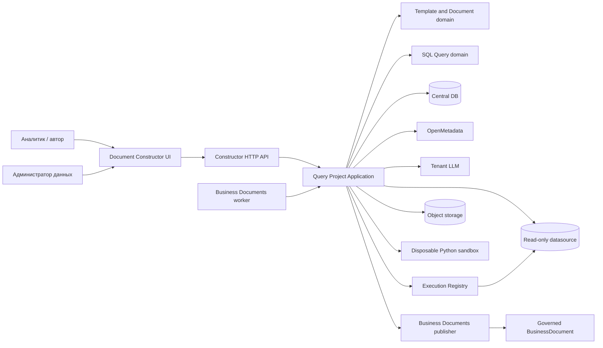
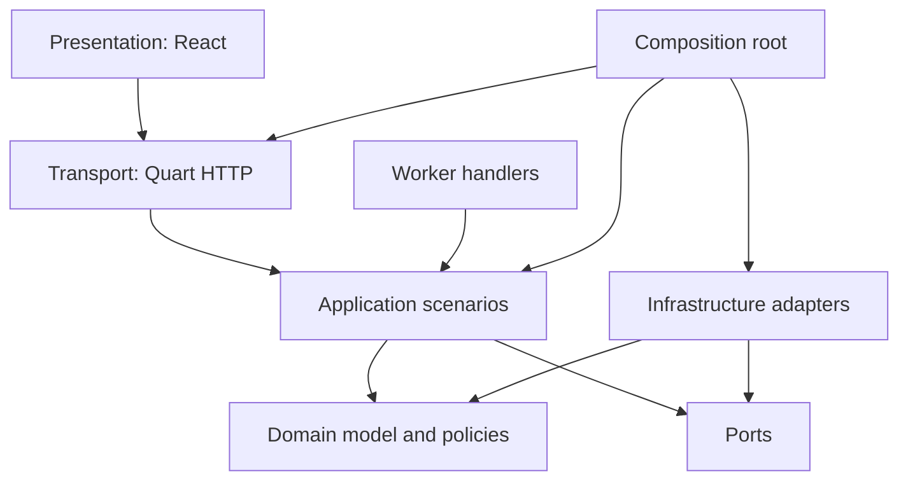
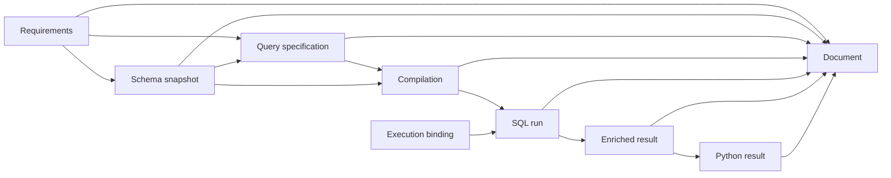
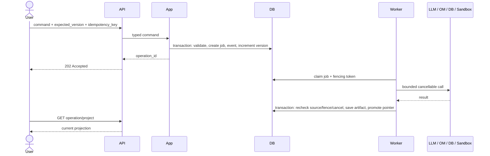
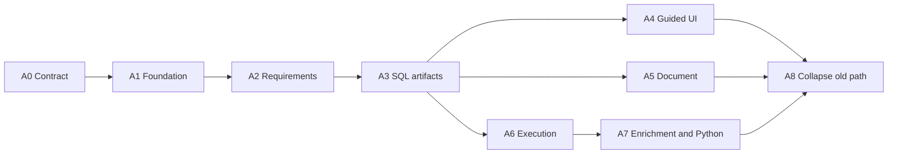

# Архитектура конструктора документов и SQL-запросов

Дата: 2026-09-14. Статус: целевая архитектура, не заявление о готовности
реализации. Продуктовые правила заданы в
[продуктовой спецификации](sql-query-constructor-product-ru.md), интерфейс — в
[UI/UX/CX-спецификации](sql-query-constructor-ui-ux-cx-ru.md), фактическое
покрытие — в [регрессии](sql-query-constructor-regression-ru.md).

Документ конкретизирует общие правила
[архитектуры RAGFlow](architecture-and-code-quality-ru.md) для локального
расширения Business Documents. Его цель — дать один путь реализации без
параллельных доменных моделей, скрытой логики во frontend и нового фреймворка
плагинов.

## 1. Архитектурный результат

Конструктор должен хранить не набор независимых форм, а единый проект создания
запроса. В проекте последовательно появляются проверяемые артефакты:

```text
исходные требования
  → атомарные требования и вопросы
  → снимок схемы и подтверждённые сопоставления
  → спецификация запроса
  → проверенная компиляция SQL
  → привязка к execution profile
  → результат и дополнительные данные
  → план и результат Python-постобработки
  → версия итогового документа
```

Главный архитектурный инвариант:

> любое существенное решение пользователя и любой производный результат
> сохраняются с происхождением и версиями входов; ни LLM, ни UI, ни worker не
> могут незаметно заменить подтверждённое решение.

Решение остаётся модульным монолитом RAGFlow. Отдельные процессы допускаются
только там, где нужна реальная граница безопасности или ресурсов: существующий
worker и изолированная среда Python.

## 2. Классификация изменения и границы владения

Конструктор является локальным расширением, владельцем которого остаётся
`business_documents`. Он интегрируется со стандартными механизмами RAGFlow, но
не переносит их код и не меняет общую структуру upstream.

Отдельный корневой пункт `Конструктор документов` — граница информационной
архитектуры UI, а не основание дублировать backend ACL, audit и publication
lifecycle. Поэтому route и страницы самостоятельны, но backend остаётся в
владеющем bounded context Business Documents.

| Поверхность | Классификация | Правило |
|---|---|---|
| `business_documents/document_constructor/` | локальное расширение | общий домен шаблонов и документа |
| `business_documents/sql_query/` | локальное расширение | домен и сценарии SQL-проекта |
| `api/apps/business_documents/` | локальные адаптеры | Peewee, OpenMetadata, LLM, registry, storage |
| `api/apps/restful_apis/` | минимальная интеграция с core | только HTTP и регистрация маршрутов |
| `web/src/pages/business-documents/constructor/` | локальное frontend-расширение | UI проекта, шаблонов и SQL-источников |
| существующий Business Documents worker | локальная интеграция | новые job handlers без второго планировщика |

Перед реализацией записи нужно обновить затронутые T0 provenance records. Для
существующих SQL-маршрутов репозиторный поиск сейчас показывает только
внутренние UI, тесты, документацию и quality-конфигурацию. Это позволяет
планировать атомарную миграцию, но не доказывает отсутствие внешних клиентов —
внешний контракт проверяется отдельно до удаления маршрутов.

## 3. Ключевые архитектурные решения

| Решение | Почему | Что сознательно не делаем |
|---|---|---|
| `SqlQueryProject` — отдельный агрегат в Business Documents | его workflow, версии и capability gates отличаются от опубликованного бизнес-документа | не маскируем проект под `BusinessDocument` и не обходим L5-каталог |
| Итог публикуется через явный `BusinessDocumentPublisherPort` | публикация повторно применяет ACL, каталог и lifecycle Business Documents | не пишем напрямую в таблицы `BusinessDocument` |
| Общий `document_constructor` содержит только шаблоны, AST и сборку | эти понятия пригодны не только SQL-шаблону | не создаём универсальный low-code/plugin framework |
| SQL-семантика принадлежит `sql_query` | сущности, joins, filters, compilation и execution образуют один bounded context | не разносим каждый шаг по отдельному сервису |
| Root row + immutable artifacts + audit events | простые чтения и надёжная трассировка | не используем event sourcing как источник состояния |
| Все внешние зависимости скрыты портами | один application flow работает в API и worker | не передаём ORM, HTTP session или SDK в domain/application |
| LLM предлагает, deterministic code проверяет, пользователь подтверждает | предотвращает недоказанные сопоставления и SQL | не разрешаем LLM самостоятельно выполнять запросы или принимать неоднозначность |
| Центральный registry + отдельный versioned execution profile | каталог описывает данные, профиль — физическое безопасное выполнение | не храним пароль или DSN в проекте и schema snapshot |
| Большие результаты лежат в object storage | БД хранит метаданные, lineage и checksum | не кладём строки результата в event log или root JSON |
| Python выполняется в disposable sandbox | allowlist внутри основного процесса не является изоляцией | не копируем in-process `exec` из экспериментального FinAI-контура |
| Один существующий worker обрабатывает долгие операции | переиспользуются retry, heartbeat и cleanup | не добавляем новую очередь или микросервис без нагрузки, которая это оправдает |

## 4. Контекст системы



OpenMetadata и execution registry намеренно показаны отдельно:

- OpenMetadata отвечает на вопрос «что означает таблица/поле и каковы связи»;
- execution profile отвечает на вопрос «куда, кем, с какими лимитами и
  политиками можно выполнить запрос»;
- binding связывает конкретную catalog service/database со строго определённой
  версией профиля;
- отсутствие или неоднозначность binding блокирует выполнение, но не создание
  спецификации.

## 5. Слои и разрешённые зависимости



Зависимости направлены внутрь:

1. Domain импортирует только стандартную библиотеку и соседние чистые типы.
2. Application импортирует domain и абстрактные порты.
3. Ports не импортируют конкретные Peewee models, Quart, pandas, OpenMetadata
   SDK или сетевые клиенты.
4. Adapters реализуют порты и преобразуют внешние ошибки/DTO в ошибки модуля.
5. Transport разбирает HTTP, вызывает один сценарий и формирует envelope.
6. Worker вызывает тот же application scenario, а не альтернативную бизнес-
   реализацию.
7. Composition root — единственное место, где собираются конкретные адаптеры.
8. Frontend не компилирует SQL, не вычисляет бизнес-статусы и не знает secret
   fields execution profile.

Запрещённые зависимости:

```text
domain          -X-> api / ORM / HTTP / SDK / React
application     -X-> concrete repository / request context / pandas
document core   -X-> sql_query
transport       -X-> прямые записи в БД
worker          -X-> своя версия compiler или validation
frontend        -X-> LLM prompt / DB credentials / policy calculation
```

`sql_query` может использовать публичные чистые типы `document_constructor` для
проекции результата в документ. Обратный импорт запрещён.

## 6. Целевая структура backend-модулей

```text
business_documents/
  document_constructor/
    __init__.py
    template_model.py
    template_validation.py
    document_model.py
    assembly.py
    application.py
    ports.py
    errors.py
    templates/
      sql-query-step-by-step.v1.json

  sql_query/
    __init__.py
    domain/
      project.py
      requirements.py
      decisions.py
      artifacts.py
      errors.py
    application/
      projects.py
      requirements.py
      schema.py
      specification.py
      execution.py
      postprocessing.py
      documents.py
      operations.py
      dto.py
      ports.py
    schema/
      model.py
      resolution.py
    specification/
      model.py
      parsing.py
      planning.py
      compiler.py
      sql_guard.py
    execution/
      model.py
      registry.py
      result_gate.py
      additional_data.py
    postprocessing/
      model.py
      policy.py
    document/
      projection.py
      traceability.py
```

Разбиение следует capability, а не техническим суффиксам:

- flat `document_constructor` остаётся небольшим общим ядром: модели и
  assembler чистые, `application.py` управляет версиями шаблонов/документов,
  `ports.py` объявляет их persistence-контракты;
- `domain` содержит агрегат, value objects, transitions и инварианты;
- `application` координирует use cases и транзакции отдельными scenario-
  модулями; общего god service нет;
- `schema` разрешает сущности/поля и строит immutable snapshot;
- `specification` хранит typed query model, планирует и компилирует SQL;
- `execution` применяет registry/profile, лимиты, ResultGate и enrichment;
- `postprocessing` описывает контракт Python-плана без зависимости от pandas;
- `document` строит трассировку и input для общего assembler.

Текущие крупные чистые файлы переносятся по владельцам, а не копируются:

| Текущий путь | Целевой владелец |
|---|---|
| `sql_query/schema_resolution.py` | `schema/model.py`, `schema/resolution.py` |
| `sql_query/query_planning.py` | `specification/planning.py` |
| `sql_query/query_specification.py` | `specification/model.py`, `compiler.py`, `sql_guard.py` |
| `sql_query/execution_registry.py` | `execution/model.py`, `registry.py` |

Каждый перенос выполняется отдельным coherent increment: потребители и тесты
переводятся вместе, старый путь удаляется в том же изменении. Постоянные
re-export shim и папки `legacy` не создаются.

## 7. Общий модуль конструктора документов

### 7.1 TemplateDefinition

Шаблон — версия структуры документа, а не уже созданный документ. Он содержит:

- стабильные `template_id`, `version`, `name`, `description`;
- ordered tree секций;
- тип каждой секции (`markdown`, `requirements`, `schema`, `query`, `result`,
  `python`, `traceability`);
- обязательность и completion rule;
- допустимые дочерние блоки и cardinality;
- ссылки на источники данных проекта;
- capability requirements;
- JSON Schema версии payload.

Опубликованная версия immutable. Редактирование создаёт draft следующей версии.
Проект закрепляет точную версию; обновление шаблона — явная команда с preview
изменений и миграцией документа.

Канонический SQL-шаблон хранится server-side. Frontend получает его через API,
поэтому JSON из web bundle не становится вторым источником истины.

### 7.2 Document AST

Assembler работает с нейтральным AST:

```text
Document
  metadata
  sections[]
    id
    title
    status
    blocks[]
      kind
      payload
      source_artifact_ids[]
      source_requirement_ids[]
```

Markdown — один из renderers, а не внутренняя модель. Это позволяет позднее
добавить DOCX/PDF без изменения SQL-домена.

Assembler обязан:

- выдавать один и тот же результат для одинаковых входов;
- не терять source IDs и решения;
- явно помечать отсутствующие обязательные секции;
- сохранять исходный Mermaid/PlantUML при ошибке render;
- не выполнять SQL или Python во время сборки;
- вычислять `content_hash` и список точных версий входных артефактов.

## 8. Агрегат SqlQueryProject

`SqlQueryProject` — consistency boundary одного пользовательского результата.
В root хранится только текущая сводка и указатели на immutable artifacts.

Минимальные поля:

```text
id, tenant_id, owner_id
title, description
template_id, template_version
mode
current_stage
specification_gate, execution_gate, postprocessing_gate
current_requirements_id
current_schema_snapshot_id
current_query_specification_id
current_compilation_id
current_execution_binding_id
current_result_id
current_python_plan_id
current_python_result_id
current_document_revision_id
state_version
created_at, updated_at
```

`mode` — выбранный продуктовый режим проекта. Эффективный capability profile
не сохраняется как вечная истина: он вычисляется сервером для текущих actor,
tenant, project, source и runtime configuration. Версии profile/binding
фиксируются только в конкретном execution artifact.

Состояние не представляется одной огромной enum. Используются независимые оси:

- `current_stage`: где работает пользователь;
- `specification_gate`: можно ли получить проверенный SQL;
- `execution_gate`: можно ли запускать БД;
- `postprocessing_gate`: можно ли запускать Python;
- status каждой requirement/decision/artifact/job.

Это предотвращает комбинаторный взрыв вроде
`WAITING_SCHEMA_BUT_COMPILED_WITH_PYTHON_DISABLED`.

### 8.1 Инварианты агрегата

1. Любой current artifact принадлежит этому проекту и имеет ожидаемый kind.
2. `state_version` увеличивается при каждом пользовательски значимом изменении.
3. Принятое решение ссылается на существующий вопрос и один из предложенных
   вариантов либо содержит явно подтверждённый custom value.
4. Compilation ссылается на точные версии specification и schema snapshot.
5. Run ссылается на точные compilation и execution profile version.
6. Python run ссылается на immutable input result и immutable plan.
7. Document revision ссылается только на существующие immutable artifacts.
8. Нельзя повысить gate на основании незавершённой job или предложения LLM.
9. Изменение upstream artifact инвалидирует только его downstream-потомков.
10. Tenant и access policy проверяются до чтения проекта и ещё раз перед
    внешним выполнением.

### 8.2 Инвалидация

Граф зависимостей артефактов определяет откат:



Например, изменение WHERE создаёт новую QuerySpecification, очищает current
Compilation/Run/Python/Document, но не удаляет историю и не заставляет заново
подтверждать неизменившееся сопоставление сущности.

## 9. Атомарные требования и решения

`RequirementSet` содержит элементы с устойчивыми IDs:

```text
REQ-OUT-*    поля результата
REQ-JOIN-*   соединения
REQ-FLT-*    условия фильтрации
REQ-SORT-*   сортировка
REQ-LIMIT-*  лимиты
REQ-CTX-*    бизнес-контекст и допущения
```

Каждый элемент имеет natural-language statement, normalized intent, status,
source span и связи с decision/artifact IDs. Одно условие WHERE — один
requirement item; составное условие хранит явное дерево AND/OR.

Неоднозначность — отдельный `DecisionRequest`, а не текст в чате:

```text
id, kind, question, reason
options[] { value, label, evidence[], confidence }
required
status: OPEN | RESOLVED | OBSOLETE
resolution, resolved_by, resolved_at
```

Application запрещает продвижение шага, пока остаются обязательные `OPEN`
решения. LLM confidence помогает сортировать варианты, но не заменяет evidence
и подтверждение.

## 10. Immutable artifacts и lineage

Один typed envelope уменьшает число однотипных persistence-механизмов:

```text
SqlQueryArtifact
  id, tenant_id, project_id
  kind, schema_version, revision
  payload | object_ref
  content_hash, byte_size
  source_artifact_ids[]
  source_requirement_ids[]
  producer, producer_version
  created_by, created_at
```

Поддерживаемые kinds:

- `REQUIREMENTS`;
- `SCHEMA_SNAPSHOT`;
- `QUERY_SPECIFICATION`;
- `COMPILATION`;
- `EXECUTION_BINDING`;
- `RAW_RESULT_METADATA`;
- `ENRICHED_RESULT_METADATA`;
- `ADDITIONAL_DATA_REQUEST`;
- `PYTHON_PLAN`;
- `PYTHON_RESULT_METADATA`;
- `TRACEABILITY`;
- `DOCUMENT_INPUT`.

Envelope общий, но payload каждого kind валидируется закрытой версионированной
схемой. В domain application payload всегда typed; произвольный `dict` остаётся
на границе сериализации.

Event log хранит факты (`REQUIREMENTS_ACCEPTED`, `SQL_COMPILED`,
`RUN_REJECTED`) и служит аудитом. Восстанавливать root посредством replay для
обычного чтения не требуется.

## 11. Application layer

Application layer предоставляет отдельные команды и запросы, а не один god
service. Scenario modules группируются по capability; composition root выдаёт
transport/worker ровно требуемый handler.

### 11.1 Команды

- `CreateProject`;
- `AnalyzeRequirements`, `AcceptRequirements`;
- `ResolveSchema`, `AcceptSchemaDecision`;
- `PlanQuery`, `SaveQuerySpecification`, `CompileQuery`;
- `ResolveExecutionBinding`, `StartSqlRun`, `CancelSqlRun`;
- `CreateAdditionalDataRequest`, `StartEnrichment`;
- `SavePythonPlan`, `StartPythonRun`, `CancelPythonRun`;
- `AssembleDocument`, `PublishBusinessDocument`;
- `UpgradeTemplateVersion`, `ArchiveProject`.

Каждая mutating command получает:

```text
actor + tenant
project_id
expected_state_version
idempotency_key
typed payload
```

### 11.2 Queries

- список проектов с фильтрами;
- `ProjectWorkspaceProjection`;
- requirement/decision details;
- schema evidence и ER projection;
- compilation и traceability;
- job/run status;
- result preview с маскированием;
- document preview и revision history;
- template list/version/diff;
- registry/profile/binding projections.

Query-side может читать оптимизированные projections, но не содержит второй
набор бизнес-правил.

### 11.3 Порты

Минимальный набор интерфейсов:

```text
UnitOfWork
QueryProjectRepository
ArtifactRepository
TemplateRepository
DocumentRevisionRepository
AccessPolicyPort
CatalogPort
SchemaInspectionPort
LlmInterpretationPort
ExecutionRegistryPort
SqlExecutionPort
ResultStorePort
PythonSandboxPort
JobRepository
AuditPort
BusinessDocumentPublisherPort
Clock / IdGenerator
```

Сценарий получает только необходимые ему порты. Общий мешок `Dependencies` не
передаётся — это скрывает связанность и нарушает ISP.

## 12. Infrastructure adapters

Целевые локальные адаптеры:

```text
api/apps/business_documents/sql_query_adapters/
  repository.py          # Peewee + UnitOfWork
  templates.py           # central DB and packaged seed
  catalog.py             # OpenMetadata
  schema_inspection.py   # optional bounded DB introspection
  llm.py                 # tenant LLM routing
  registry.py            # central registry/profile/binding
  postgres.py            # read-only execution
  result_store.py        # STORAGE_IMPL / object storage
  python_sandbox.py      # disposable sandbox protocol
  publisher.py           # governed BusinessDocument API
  audit.py
  composition.py
```

Правила адаптеров:

- адаптер переводит внешнюю модель в owned DTO и обратно;
- сетевые/ORM исключения не протекают в domain;
- retry принадлежит границе конкретной интеграции либо job policy, но не обоим
  одновременно;
- adapter не решает, можно ли перейти к следующему этапу;
- secrets получаются по secret reference непосредственно перед вызовом;
- каждый внешний вызов имеет deadline и cancellation;
- capability отсутствующего адаптера равна `false`, а не «вероятно доступно».

## 13. Persistence model

Существующие таблицы центрального реестра сохраняются:

- `BusinessDocumentSqlExecutionProfile`;
- `BusinessDocumentSqlCatalogBinding`.

Добавляются следующие владельцы данных.

### 13.1 Шаблоны

`document_constructor_template`:

- identity, tenant/system scope, name, lifecycle;
- current draft/published version pointers;
- ACL metadata.

`document_constructor_template_version`:

- immutable definition JSON;
- schema version, content hash;
- created/published metadata.

### 13.2 Проект

`business_document_sql_query_project`:

- root fields из раздела 8;
- индексы `(tenant_id, updated_at)`, `(tenant_id, owner_id, updated_at)`;
- optimistic `state_version`;
- soft archive, но не soft-delete артефактов.

`business_document_sql_query_artifact`:

- typed immutable artifact envelope;
- unique `(project_id, kind, revision)`;
- checksum и object reference для больших payload.

`business_document_sql_query_event`:

- монотонный sequence внутри проекта;
- actor, operation, before/after artifact IDs, safe metadata;
- без credentials, строк результата и полного prompt.

`business_document_sql_query_command`:

- idempotency ledger;
- unique `(tenant_id, project_id, idempotency_key)`;
- request hash, response reference, status.

`business_document_sql_query_job`:

- operation kind, status, attempts, deadline;
- source project version и source artifact IDs;
- cancellation/fencing token;
- safe error code/details.

`document_constructor_revision`:

- immutable AST/renderer output;
- exact template version, source artifact IDs, content hash;
- optional published BusinessDocument/revision reference.

### 13.3 Где хранится результат

В центральной БД остаются schema, columns, row count, preview policy, checksum,
object reference и lineage. Полный набор строк хранится через `ResultStorePort`.
Preview возвращает ограниченное, маскированное окно.

Объект публикуется безопасно:

1. worker пишет временный объект;
2. вычисляет checksum и размер;
3. в транзакции создаёт immutable metadata artifact;
4. переводит объект в published namespace или фиксирует final reference;
5. reconciliation удаляет осиротевшие временные объекты.

## 14. Транзакции, конкурентность и идемпотентность

### 14.1 Короткая команда

В одной DB-транзакции выполняются:

1. tenant/ACL check;
2. загрузка root с проверкой `expected_state_version`;
3. проверка инвариантов;
4. создание immutable artifact/decision/event;
5. обновление current pointers и `state_version`;
6. сохранение idempotent response reference.

LLM, OpenMetadata, datasource, object storage и sandbox никогда не вызываются
внутри этой транзакции.

### 14.2 Долгая операция



Stale worker не может повысить current pointer, если:

- project version или source artifact изменились;
- job отменена;
- lease/fencing token уже сменился;
- deadline истёк.

Такая job завершается `OBSOLETE` или `CANCELLED`, а полученный временный объект
удаляется reconciliation-процессом.

Idempotency key привязан к hash запроса. Повтор с тем же key и другим payload
возвращает conflict; с тем же payload — исходный operation/result.

## 15. Жизненный цикл SQL

### 15.1 Requirements → schema

LLM получает только разрешённый контекст и формирует:

- атомарные requirements;
- кандидаты сущностей/полей;
- вопросы и варианты;
- ссылки на catalog evidence;
- уровень уверенности и причины.

`SchemaResolutionScenario` детерминированно проверяет кандидатов по каталогу.
Неоднозначность не выбирается автоматически. Подтверждённый
`SchemaSnapshot` содержит service/database/schema/table/column identity,
relationships, captured_at, catalog revision/fingerprint и evidence.

Snapshot — не копия всей БД и не DSN. Он закрепляет только доказательства,
нужные конкретному проекту.

Основной источник snapshot — OpenMetadata. Если метаданных недостаточно и
capability разрешена, отдельный `SchemaInspectionPort` может выполнить
ограниченную introspection через выбранный read-only profile. Catalog evidence
и физическая introspection не сливаются молча: несовпадение типов, полей или
связей создаёт blocking decision. LLM не является источником факта о схеме.

### 15.2 Specification → compilation

`QuerySpecification` — единственный semantic source SQL:

```text
sources
select_items
joins (relation predicates only)
filters (typed expression tree)
group_by
having
order_by
limit
subqueries / CTEs
requirement_links
```

Compiler генерирует SQL только из этой модели. Ручной SQL допустим как import:
он сначала парсится обратно в specification и показывает semantic diff. Если
поддерживаемая конструкция не распознана, проект не притворяется управляемым и
просит выбрать advanced/manual mode с отдельным gate.

Join predicate описывает способ связи таблиц. Ограничение набора строк
принадлежит `filters`, даже если LLM первоначально предложила его внутри `ON`.
Для outer join, где размещение предиката меняет смысл, классификация становится
явным решением пользователя. Document projection отдельно и детерминированно
строит список полей/источников, joins и представление `SELECT без фильтров`; это
не второй SQL source of truth.

SQLGuard — независимая детерминированная проверка после compilation и ещё раз
перед execution. Он запрещает DDL/DML, multiple statements, недопустимые
functions/schemas, unbounded policies и конструкции вне профиля.

### 15.3 Execution

Перед запросом фиксируются точные версии:

```text
schema snapshot
query specification
compilation
catalog binding
execution profile
SQL guard policy
```

Физическая БД использует отдельную read-only роль. Ограничения должны
дублироваться на стороне БД/profile: statement timeout, row/byte limits,
разрешённые schemas, concurrency quota. Проверка только в приложении
недостаточна.

`ResultGate` проверяет schema результата, объём, ожидаемые поля, nullability,
маскирование, предупреждения и достаточность данных. Только принятый результат
может стать входом enrichment/Python/document.

## 16. Дополнительные данные и расшифровка ID

Подсценарий реализуется тем же query lifecycle, а не скрытым SQL от LLM.

`AdditionalDataRequest` содержит:

- какие result columns требуют расшифровки;
- множество уникальных IDs или bounded reference на него;
- proposed lookup entity/table/fields/join;
- purpose и требуемый output contract;
- связь с исходным result artifact;
- status решения пользователя.

Если lookup известен до основного запроса, он становится обычным join/subquery
в `QuerySpecification`. Если необходимость обнаружена после выполнения:

1. LLM предлагает дополнительную specification;
2. schema resolution подтверждает таблицу и поля;
3. пользователь принимает mapping и ограничения;
4. compiler и SQLGuard строят отдельную compilation;
5. SQL выполняется тем же profile и policy;
6. deterministic enrichment join создаёт новый immutable result;
7. lineage сохраняет оба исходных результата и правило объединения.

LLM может запросить дополнительные данные только через этот артефакт. Оно не
получает произвольный SQL channel и credentials.

## 17. Python-постобработка

Application оперирует непрозрачными типами:

```text
ResultHandle
FrameSchema
PythonPlan
PythonRunResult
```

Pandas/Polars принадлежат sandbox adapter. `PythonPlan` фиксирует code,
entrypoint, declared inputs/outputs, environment image/version, packages из
allowlist, CPU/RAM/time/output limits и source result IDs.

Pipeline:

```text
accepted result
  → proposed PythonPlan
  → static policy validation
  → human confirmation
  → disposable sandbox
  → output schema/size validation
  → immutable Python result
  → document projection
```

Sandbox не имеет application credentials и произвольной сети; получает
read-only input handle и отдельный write-only output namespace. Процесс
уничтожается после выполнения. Cancellation и deadline обязательны.

Подход FinAI с opaque frame port полезен как форма границы, но его текущий
in-process `exec` не является production sandbox и не переносится в RAGFlow.

## 18. Публикация итогового документа

Сборка и публикация разделены:

- `AssembleDocument` создаёт immutable constructor revision;
- `PublishBusinessDocument` вызывает адаптер действующего governed workflow.

Publisher повторно проверяет:

- tenant ACL и право `capabilities.create === true`;
- допустимый L5 catalog entry;
- обязательные sections/template rules;
- absence of unresolved decisions;
- source hashes и актуальность артефактов;
- policy редактирования/публикации.

Проект хранит ссылку на опубликованный document/revision, но не становится его
скрытым subtype. Дальнейший lifecycle опубликованного документа остаётся у
Business Documents.

## 19. HTTP API

Transport выносится из растущего `business_document_api.py` в узкий route
module, зарегистрированный стандартным loader:

```text
api/apps/restful_apis/document_constructor_api.py
```

Целевой project-scoped контракт:

```text
POST   /api/v1/business-documents/sql-query/projects
GET    /api/v1/business-documents/sql-query/projects
GET    /api/v1/business-documents/sql-query/projects/{project_id}
PATCH  /api/v1/business-documents/sql-query/projects/{project_id}
GET    /api/v1/business-documents/sql-query/projects/{project_id}/capabilities

POST   .../{project_id}/requirements/analyze
POST   .../{project_id}/requirements/accept
POST   .../{project_id}/schema/resolve
POST   .../{project_id}/schema/decisions/{decision_id}/accept
POST   .../{project_id}/query/plan
PUT    .../{project_id}/query/specification
POST   .../{project_id}/query/compile
POST   .../{project_id}/execution-binding/resolve
POST   .../{project_id}/runs
POST   .../{project_id}/runs/{run_id}/cancel
POST   .../{project_id}/additional-data-requests
POST   .../{project_id}/python-plans
POST   .../{project_id}/python-runs
POST   .../{project_id}/documents

GET    /api/v1/business-documents/constructor/templates
GET    /api/v1/business-documents/constructor/capabilities
GET    /api/v1/business-documents/constructor/templates/{id}/versions/{version}
POST   /api/v1/business-documents/constructor/templates
POST   /api/v1/business-documents/constructor/templates/{id}/publish
GET    /api/v1/business-documents/sql-sources
```

Mutations требуют `expected_version` и `Idempotency-Key`. Долгие операции
возвращают `202` и operation ID. На первом этапе используется существующее
polling-поведение; SSE можно добавить позднее за тем же operation contract.

Ошибки имеют стабильные code и category:

```text
VALIDATION_ERROR
AMBIGUOUS_MAPPING
STALE_PROJECT_VERSION
CAPABILITY_DISABLED
FORBIDDEN
NOT_FOUND
DEPENDENCY_UNAVAILABLE
POLICY_REJECTED
OPERATION_CANCELLED
INTERNAL_ERROR
```

HTTP status не заменяет machine-readable code. В ответ не попадают traceback,
prompt, credentials или raw connector errors.

## 20. Frontend-модули

```text
web/src/pages/business-documents/constructor/
  api/
    client.ts
    contracts.ts
    query-keys.ts
  projects/
    list-page.tsx
    create-page.tsx
    workspace-page.tsx
    steps/
      requirements-step.tsx
      data-step.tsx
      query-step.tsx
      validation-step.tsx
      result-step.tsx
      document-step.tsx
  templates/
    list-page.tsx
    editor-page.tsx
  sql-sources/
    registry-page.tsx
    profile-editor.tsx
    binding-editor.tsx
  components/
    project-header.tsx
    stage-stepper.tsx
    requirement-card.tsx
    decision-card.tsx
    evidence-drawer.tsx
    operation-status.tsx
    action-bar.tsx
```

Frontend state разделяется:

- server state: project projection, artifacts, decisions, operations, registry;
- URL state: `project_id`, active stage, selected requirement/decision;
- local state: незасохранённые поля формы, текущий selection, открытие drawer;
- ephemeral editor state: explicit dirty flag и recoverable draft.

Не допускаются:

- полноценный `QueryProject` в `localStorage`;
- вычисление gates по набору клиентских boolean;
- дублирование шаблона в TypeScript и JSON bundle;
- прямой вызов stateless planner/compiler минуя project version;
- один dialog на весь шестишаговый workflow.

Существующий localStorage draft можно импортировать однократно по явному
предложению пользователя. Автоматическая отправка старого локального payload на
сервер запрещена.

Capability UI работает fail-closed: создание, выполнение и Python показываются
активными только при точном `=== true`; loading и unknown не дают краткого
доступа к действию.

## 21. Composition и runtime

Composition root создаёт application services для HTTP и worker из одинаковых
реализаций портов. Request actor/tenant передаются явно, глобальный request
context не входит в application command.

Долгие job обрабатываются существующим процессом Business Documents:

- добавляются новые operation kinds и handlers;
- сохраняются действующие claim/heartbeat/retry/cancel/cleanup контракты;
- регистрация handler проверяется точным inventory test;
- graceful shutdown отменяет external call и освобождает lease;
- unknown operation kind завершается контролируемой ошибкой, а не вечным retry.

Новый standalone service не нужен до появления измеренной независимой нагрузки
или требования изоляции, которое нельзя удовлетворить sandbox/container job.

## 22. Безопасность и trust boundaries

Недоверенными считаются browser payload, LLM output, catalog metadata,
datasource rows, imported SQL и Python code.

Обязательные защиты:

- tenant/ACL на каждом root lookup и перед каждым внешним действием;
- closed DTO и bounds на коллекции/строки;
- prompt injection не меняет доступные tools и политики;
- schema evidence фильтруется по доступному catalog scope;
- secrets остаются в registry/secret provider;
- SQLGuard + read-only DB role + server-side timeout/limits;
- preview masking и запрет необязательного логирования строк;
- disposable Python sandbox без application identity;
- immutable lineage и safe audit;
- отмена и deadline проходят до реального клиента;
- stale result не становится current.

Это архитектурная база, а не завершённая threat model. Перед включением
`EXECUTION_ENABLED` и `POSTPROCESSING_ENABLED` нужен отдельный repository-
grounded threat modeling и проверка конфигурации runtime.

## 23. Наблюдаемость

Все операции получают `correlation_id`, `project_id`, `operation_id`, tenant-safe
actor ID и версии входных артефактов. Метрики не содержат SQL literals и rows.

Минимальные метрики:

- latency/success/error по scenario и adapter;
- число открытых ambiguity decisions;
- доля stale/obsolete jobs;
- compile и SQLGuard rejection reasons;
- queue wait, execution time, cancellation latency;
- input/output rows и bytes только агрегатами;
- ResultGate rejection reasons;
- sandbox resource/time limit hits;
- document assembly completeness;
- capability-denied actions.

Audit отвечает «кто и что подтвердил», technical log — «почему сломалась
операция». Они не заменяют друг друга.

## 24. KISS и SOLID

### KISS

- один агрегат проекта вместо синхронизации шести форм;
- один artifact envelope с закрытыми typed payload вместо таблицы на каждый
  промежуточный JSON;
- root snapshot для чтения + events для аудита вместо event sourcing;
- существующий worker и storage abstraction вместо новой платформы;
- project-scoped API вместо набора несвязанных stateless endpoints;
- polling сначала, streaming только при доказанной необходимости;
- один compiler и один SQLGuard для API и worker.

### SOLID

| Принцип | Применение |
|---|---|
| SRP | template, requirements, schema, specification, execution, Python и document имеют отдельных владельцев |
| OCP | новый renderer или adapter добавляется через узкий port; core-модель не знает SDK |
| LSP | fake/real adapters проходят одинаковые contract tests и сохраняют семантику ошибок/cancel |
| ISP | scenario получает только нужные порты, нет god dependency container |
| DIP | application зависит от Protocol, concrete Peewee/LLM/Postgres/sandbox подключаются composition root |

OCP не означает plugin framework: расширение допустимо в заранее определённых
точках, а не через универсальный runtime registration.

## 25. Проверки по слоям

| Уровень | Что доказывает |
|---|---|
| Domain unit | transitions, invalidation, decision и artifact invariants |
| Application unit с fake ports | orchestration, permissions, idempotency, stale fencing, cancel |
| Adapter contract | одинаковая семантика real/fake adapter, mapping ошибок и deadlines |
| Persistence integration | реальные constraints, transaction race, tenant isolation, optimistic lock |
| API contract | closed DTO, auth, statuses, version/idempotency headers, route inventory |
| Frontend component | step states, dirty recovery, fail-closed capability, accessibility |
| Browser C1 | полный UX без реальной БД, включая неоднозначность и document preview |
| Golden G1 | requirements → exact specification → exact SQL → exact document |
| Disposable PostgreSQL I1 | read-only execution, timeout, ResultGate, ID enrichment |
| Sandbox integration | isolation, packages, resource limits, cancellation, output contract |
| Live LLM opt-in | реальный tenant routing без превращения flaky проверки в merge gate |

Архитектурные проверки:

- ARC-01: domain/application не импортируют ORM/network/request;
- ARC-02: OpenMetadata, LLM, DB, storage, sandbox и publisher за портами;
- ARC-03: нет eager cycles, лишних exports и unresolved dynamic registration;
- ARC-04: API и worker используют один application owner;
- DATA-01: tenant authorization и ограничения доступа;
- DATA-02: transaction, idempotency, retry, cancellation и fencing;
- TEST-01: behavioural evidence на реальном уровне интеграции.

Статические observers могут дать `OBSERVED`, но это не равнозначно PASS.
Отсутствующая БД, sandbox или live dependency означает `INCOMPLETE` для
соответствующего уровня.

## 26. Последовательность миграции

### A0. Контракт и provenance

- закрепить этот документ, product и UX contract;
- обновить T0 для точных затронутых файлов;
- зафиксировать current route/template consumers и внешний support decision;
- добавить boundary tests до перемещения кода.

### A1. Constructor core и persistence foundation

- перенести канонический SQL-template server-side;
- реализовать TemplateDefinition/validation и Document AST;
- добавить project/artifact/event/command/job/revision schema;
- реализовать repository и optimistic version contract.

### A2. Requirements и decisions

- добавить project CRUD/workspace projection;
- сохранять RequirementSet и DecisionRequest;
- подключить LLM через порт;
- реализовать user confirmation и deterministic invalidation.

### A3. Schema, specification и registry

- обернуть текущие pure scenarios application-командами;
- разделить крупные файлы по capability без дублирования;
- сохранять snapshot/specification/compilation/binding artifacts;
- перевести API tests на project-scoped contract.

### A4. Guided frontend

- реализовать список/создание/workspace и шесть stages;
- заменить большие dialogs на step modules;
- перенести server state на project API;
- удалить постоянное localStorage-хранилище агрегата;
- удалить старый прямой UI flow после browser parity.

### A5. Document assembler

- собрать все sections и traceability;
- добавить deterministic markdown golden;
- реализовать diagram source fallback;
- подключить governed publisher, не обходя L5.

### A6. Controlled execution

- реализовать DB adapter, job handler и ResultStore;
- включить registry/profile fencing и повторный SQLGuard;
- реализовать ResultGate, cancel, timeout, masking и I1.

### A7. Additional data и Python

- добавить явный AdditionalDataRequest flow;
- реализовать deterministic enrichment;
- подключить disposable sandbox и opaque result contract;
- добавить Python section в assembler и sandbox integration tests.

### A8. Схлопывание старого пути

- повторить consumer audit;
- атомарно удалить stateless routes, дубли шаблона и obsolete dialogs;
- удалить временные adapters/re-exports;
- обновить exact route/worker/provenance inventories;
- прогнать cleanup/simplification protocol для затронутых owners.

Миграция не держит две production-реализации. Внутри каждого инкремента старый
путь существует только до прохождения parity checks и удаляется в том же
изменении либо инкремент не считается завершённым.

## 27. Зависимости инкрементов



`SPECIFICATION_ONLY` может быть выпущен после A5 и релевантной части A8 без
DB/Python. `EXECUTION_ENABLED` требует A6. `POSTPROCESSING_ENABLED` требует A7.
Capability profile сообщает фактический режим; UI не угадывает его по наличию
элементов меню.

## 28. Definition of Ready реализации

Инкремент готов к разработке, когда:

- определены owner, локальная/upstream классификация и T0 records;
- заданы входы, outputs, errors, ordering, side effects и инварианты;
- известны текущие direct/dynamic/external consumers;
- определены exact command, state transition и invalidation edges;
- есть acceptance scenario и выбран реальный verification layer;
- определены tenant/ACL, transaction, idempotency, cancellation и deadline;
- для внешней интеграции согласован port contract и safe error mapping;
- для миграции определено, какой старый путь удаляется.

## 29. Definition of Done архитектурного инкремента

Инкремент завершён, когда:

- существует один production owner поведения;
- domain/application boundaries проверены импортами и focused tests;
- API и worker используют одну business implementation;
- state/artifact mutations атомарны и защищены version/idempotency;
- tenant isolation и capability gates проверены негативными тестами;
- внешние вызовы bounded, cancellable и не держат DB transaction;
- stale worker не может опубликовать результат;
- UI читает server projection и fail-closed обрабатывает unknown capability;
- browser/golden/integration доказательства соответствуют реальному слою;
- obsolete code, routes, registrations, tests и docs удалены;
- quality reports интерпретированы консервативно, без расширения ignores;
- регрессионный документ обновлён фактическим статусом, включая `INCOMPLETE`.

## 30. Текущий разрыв до целевой архитектуры

На момент проектирования уже есть полезные pure capabilities для schema
resolution, query planning/specification/compilation/SQLGuard и registry
resolution, а также frontend vertical slice. Но это ещё не целевая архитектура:

- нет persisted `QueryProject` и единой версии состояния;
- template остаётся frontend-asset, а не server-owned version;
- HTTP-сценарии stateless и не создают lineage artifacts;
- orchestration добавляется в уже крупный Business Documents service;
- крупные frontend dialogs смешивают stages, API и локальное состояние;
- выполнение БД, ResultGate, object result, enrichment и sandbox отсутствуют;
- assembler и governed publication не замыкают путь до документа.

Поэтому текущий вертикальный срез следует считать основой для A3, а не
альтернативной архитектурой, которую нужно поддерживать параллельно.
