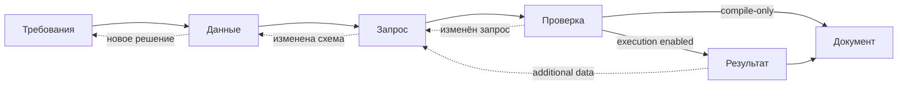

# Продуктовая спецификация конструктора SQL-запросов

Дата: 2026-09-14. Статус: целевой продуктовый контракт, не заявление о
готовности реализации. Фактическое покрытие и пробелы фиксируются отдельно в
[регрессии конструктора](sql-query-constructor-regression-ru.md).
Детальные экраны, тексты, состояния, responsive/accessibility и сквозной
клиентский опыт определены в
[UI/UX/CX-спецификации](sql-query-constructor-ui-ux-cx-ru.md). Слои, модули,
агрегат, persistence, порты и последовательность миграции закреплены в
[архитектуре конструктора](sql-query-constructor-architecture-ru.md).

## 1. Продуктовый результат

Конструктор превращает бизнес-потребность пользователя в проверяемый,
воспроизводимый и безопасный read-only SQL-запрос, а затем — при доступности
исполнительного контура — в контролируемый результат и документ с полной
трассировкой решений.

Основная работа пользователя:

> Я описываю нужный результат на естественном языке, последовательно уточняю
> сущности, поля, соединения, фильтры и ограничения, вижу происхождение каждого
> решения и получаю SQL и документ, которые можно проверить и повторить.

Продукт считается полезным уже в режиме `SPECIFICATION_ONLY`, если он создаёт
полный согласованный SQL и документ без выполнения запроса. Режимы
`EXECUTION_ENABLED` и `POSTPROCESSING_ENABLED` расширяют этот результат, но не
должны маскироваться под доступные, пока соответствующие runtime-контуры не
подтверждены.

### 1.1 Не входит в продукт

- свободный SQL IDE с выполнением произвольного текста;
- автономный агент, который сам подтверждает неоднозначности или запускает БД;
- средство миграции, изменения данных или администрирования БД;
- универсальный ETL-конструктор;
- перенос фильтрации, JOIN и сокращения объёма данных в Python без доказанной
  причины;
- обещание поддержки любого SQL, если компилятор реализует только flat-query
  профиль.

## 2. Принципы продукта

1. **Одна потребность — один проект запроса.** Все требования, решения,
   snapshots, компиляции, запуски и документы принадлежат одному `QueryProject`.
2. **LLM предлагает, человек решает.** Модель не подтверждает собственный
   вариант, не снимает blocking gate и не получает реквизиты БД.
3. **Каталог является источником фактов о схеме.** Таблица, поле и связь должны
   иметь catalog ID, версию, freshness и ссылку на источник.
4. **Сначала смысл, затем SQL.** SQL отсутствует, пока не закрыты блокирующие
   решения о гранулярности, данных, JOIN и фильтрах.
5. **Прогрессивное раскрытие.** Пользователь проходит шесть продуктовых этапов;
   44 раздела шаблона собираются автоматически и не превращаются в 44 шага.
6. **История не перезаписывается.** Изменение создаёт новую ревизию и делает
   зависимые артефакты устаревшими, сохраняя предыдущий подтверждённый результат.
7. **Исходный результат сохраняется.** Обогащение и Python-постобработка создают
   производные результаты, но не заменяют raw SQL result.
8. **Возможности честно ограничены.** UI получает server-side capabilities и
   различает `поддерживается`, `только документируется` и `недоступно`.

## 3. Роли и полномочия

Не требуется вводить новую универсальную ролевую модель. Продукт использует
действующие права Business Documents и добавляет узкие capability-проверки у
владельца операции.

| Роль продукта | Возможности | Ограничения |
| --- | --- | --- |
| Автор запроса | Создать свой проект, редактировать требования, принимать решения, компилировать | Требуется действующее `capabilities.create`; доступ только к разрешённым datasets/catalog scopes |
| Автор с правом выполнения | Всё выше, выбрать разрешённый профиль и запустить запрос | Отдельная capability выполнения; нельзя видеть connector secrets и менять профиль |
| Ревьюер | Просмотреть ревизию, требования, решения, SQL, проверки и оставить решение о согласовании | Только в рамках уже разрешённого документа; не становится владельцем datasource |
| Администратор шаблонов | Создать, проверить, опубликовать и вывести из обращения версию шаблона | Не получает автоматически доступ к данным проекта |
| Администратор SQL-источников | Управлять connectors, execution profiles и точными catalog bindings | Только superuser/managed owner; не исполняет пользовательский проект от имени автора |

Автор без права выполнения должен завершать режим `SPECIFICATION_ONLY`: получить
SQL, параметры, SQLGuard и документ, где выполнение явно имеет статус
`NOT_EXECUTED`.

## 4. Информационная архитектура

Корневой пункт навигации «Конструктор» ведёт на рабочий список проектов, а не в
редактор структуры шаблона.

| Целевая страница | Назначение |
| --- | --- |
| `/document-constructor` | Проекты пользователя, фильтры по статусу, основной CTA «Новый SQL-запрос» |
| `/document-constructor/projects/new` | Выбор шаблона, режима и источника знаний; создание проекта |
| `/document-constructor/projects/:projectId` | Основной пошаговый workspace |
| `/document-constructor/templates` | Каталог версий шаблонов |
| `/document-constructor/templates/:templateId` | Текущий редактор структуры и требований к разделам |
| `/document-constructor/admin/sql-sources` | Центральный реестр connectors, profiles и bindings |

Административные маршруты и действия не отображаются без соответствующей
capability. Скрытие UI не заменяет server-side проверку.

### 4.1 Список проектов

Карточка проекта показывает только сведения, необходимые для продолжения:

- название и исходную цель в одну строку;
- пользовательский статус и текущий этап;
- число нерешённых blocking-вопросов;
- закреплённую версию шаблона и источник схемы;
- автора и время последнего изменения;
- CTA `Продолжить`, ведущий к первому блокеру, либо `Открыть документ`.

По умолчанию показываются активные проекты текущего пользователя. Архив,
проекты других авторов и административные фильтры раскрываются только при
наличии соответствующих прав.

## 5. Единый агрегат `QueryProject`

`QueryProject` — серверный источник истины и единственный владелец переходов.
Local storage допускается только как восстанавливаемый cache незавершённого
ввода, но не как каноническое хранилище решения.

Минимальные поля корня:

| Поле | Смысл |
| --- | --- |
| `project_id` | Стабильный идентификатор проекта |
| `tenant_id`, `owner_id` | Граница владения и доступа |
| `title`, `mode` | Название и `SPECIFICATION_ONLY` / `EXECUTION_ENABLED` / `POSTPROCESSING_ENABLED` |
| `template_id`, `template_version` | Закреплённая неизменяемая версия шаблона |
| `version` | Optimistic concurrency проекта |
| `current_stage` | Текущий продуктовый этап |
| `gate_state` | `DRAFT`, `NEEDS_DECISION`, `READY`, `STALE` |
| `current_requirement_revision_id` | Принятая ревизия требований |
| `current_schema_snapshot_id` | Принятый снимок схемы |
| `current_query_spec_revision_id` | Текущая спецификация запроса |
| `active_compilation_id`, `active_binding_id` | Проверенный SQL и выбранная политика выполнения |
| `last_run_id`, `current_document_revision_id` | Последний запуск и итоговый документ |
| `created_at`, `updated_at`, `archived_at` | Жизненный цикл |

Дочерние сущности:

- `RequirementRevision` и атомарные `Requirement`;
- `Decision` с вариантами, доказательствами и ответом пользователя;
- `SchemaSnapshotRef` и выбранный ER-контур;
- `QuerySpecificationRevision`;
- `Compilation` с SQL, параметрами и SQLGuard;
- `ExecutionBinding` и неизменяемый `QueryRun`;
- `RawResult` и производные result revisions;
- `AdditionalDataRequest`;
- `PythonPlan` и `PythonRun`;
- `DocumentRevision`;
- append-only audit events значимых действий.

API и worker вызывают один application scenario. HTTP не управляет переходами
самостоятельно, а UI не собирает агрегат из нескольких независимых store.

## 6. Состояния без комбинаторного взрыва

Вместо одного большого enum используются три независимых измерения:

| Измерение | Значения |
| --- | --- |
| Этап | `REQUIREMENTS`, `DATA`, `QUERY`, `VALIDATION`, `RESULT`, `DOCUMENT` |
| Готовность этапа | `DRAFT`, `NEEDS_DECISION`, `READY`, `STALE` |
| Активная операция | `IDLE`, `QUEUED`, `RUNNING`, `SUCCEEDED`, `FAILED`, `CANCELLED` |

Пользователь видит производный короткий статус: «Черновик», «Нужно решение»,
«Готов к проверке», «Выполняется», «Результат готов», «Документ готов»,
«Требует внимания» или «Архив».



### 6.1 Правила инвалидации

Изменение не удаляет старый результат, а помечает зависимые артефакты
`SUPERSEDED` или `STALE`.

| Изменение | Что становится stale | Что сохраняется действующим |
| --- | --- | --- |
| Новая принятая ревизия требований | Сопоставления, спецификация, compilation, binding, runs, document | История предыдущей ревизии и её артефакты |
| Изменён выбор таблицы/поля/связи | Зависимые clauses, compilation, binding, runs, document | Незатронутые требования и catalog evidence |
| Изменена спецификация SQL | Compilation, runs, document | Принятые требования и snapshot |
| Изменились profile/binding version | Binding и будущий run; compilation остаётся, если диалект совместим | SQL и требования |
| Изменён Python plan | Python result и document | Raw SQL result |
| Изменена версия шаблона | Только новая document revision | Требования, SQL и raw result |

Перед execution сервер повторно проверяет versions/fingerprints требований,
snapshot, compilation, profile и binding. Старая вкладка получает conflict с
предложением перезагрузить изменения, а не молча перезаписывает проект.

## 7. Основной пользовательский сценарий

Основной workspace — отдельная страница, не цепочка модальных окон. Слева
расположены шесть этапов и счётчики блокеров, по центру — текущая работа, справа
по запросу раскрываются доказательства каталога и история решения.

### 7.1 Этап 1. Требования

**Ввод:** исходная формулировка целиком, ожидаемая бизнес-цель, при необходимости
выбранный dataset/каталог и дополнительные ограничения.

**Система:** сохраняет исходный текст без изменений и предлагает разложение на
атомарные требования. Предложение LLM визуально отделено от принятого решения.

**Пользователь:** редактирует формулировки, добавляет пропущенные требования,
отклоняет лишние и отвечает на вопросы о гранулярности, периоде, порогах,
единицах, часовом поясе и чувствительных данных.

**Gate:** определены цель, гранулярность результата и хотя бы одно требование к
выводу; каждая блокирующая неоднозначность либо закрыта, либо явно оставлена как
блокер. CTA — `Согласовать требования`.

### 7.2 Этап 2. Данные

**Система:** по каждому принятому требованию поднимает сущности, таблицы, поля,
ключи и связи из разрешённой базы знаний и OpenMetadata. Сначала загружаются
компактные кандидаты, полная схема — только для выбранных таблиц.

**Пользователь:** выбирает таблицы и поля, проверяет гранулярность, рассматривает
неоднозначные пути и подтверждает ER-контур.

**Результат:** versioned schema snapshot, выбранные catalog IDs, evidence,
freshness, fingerprint и автоматически построенная ER-диаграмма выбранного
контура.

**Gate:** все принятые требования, требующие данных, имеют сопоставление либо
явный blocking status; snapshot имеет `READY` и актуальную freshness. CTA —
`Подтвердить данные`.

### 7.3 Этап 3. Запрос

Этап содержит четыре последовательные подзадачи:

1. **Вывод:** поля, агрегаты, алиасы и гранулярность SELECT.
2. **Соединения и справочники:** порядок JOIN, ключи, тип соединения,
   кардинальность и риск размножения строк.
3. **Фильтры:** отдельная карточка для каждого условия WHERE/HAVING в пределах
   реально поддерживаемого профиля.
4. **Формат и ограничения:** ORDER BY, детерминированность, LIMIT, допустимые
   колонки, единицы и формат результата.

LLM может заполнить черновик только catalog-bound значениями. JOIN и фильтры
после любого предложения остаются неподтверждёнными.

**Gate:** каждый обязательный output, JOIN, lookup, filter и limit связан с
требованием и подтверждён пользователем. CTA — `Проверить запрос`.

### 7.4 Этап 4. Проверка

Экран одновременно показывает:

- матрицу покрытия требований;
- список blocking/warning замечаний;
- итоговый SQL и параметры раздельно;
- SQL-фрагмент для каждого JOIN и фильтра;
- SQLGuard и поддержанный dialect/capability profile;
- выбранный execution binding без секретов.

При наличии блокеров SQL отсутствует. После успешной компиляции доступны:

- `Собрать документ без выполнения` для `SPECIFICATION_ONLY`;
- `Выполнить запрос` при доступной capability и валидном binding.

### 7.5 Этап 5. Результат

Перед запуском пользователь видит профиль, relation mappings, timeout, лимиты
строк/байт и набор передаваемых параметров. Секреты connector не отображаются.

Run является неизменяемым. Повтор создаёт новый `run_id` и ссылается на тот же
или новую compilation revision. Пользователь может отменить активную операцию.

После ResultGate показываются:

- статус, длительность, количество строк и размер;
- raw preview с признаком полного или усечённого результата;
- проверки схемы, типов, NULL, сериализации и гранулярности;
- предупреждения о дублях, неожиданных значениях или необходимости справочника;
- вкладка опциональной Python-постобработки.

### 7.6 Этап 6. Документ

Assembler создаёт документ из канонических данных проекта. Пользователь
проверяет покрытие, добавляет разрешённые пояснения и создаёт неизменяемую
`DocumentRevision`.

CTA `Завершить документ` доступен, когда:

- нет blocking decisions и stale артефактов;
- каждое принятое требование имеет финальный coverage status;
- обязательные разделы заполнены либо имеют разрешённый `NOT_APPLICABLE` с
  причиной;
- SQLGuard прошёл;
- статус выполнения и Python честно отражают выбранный режим.

## 8. Атомарная модель требований

Исходный текст всегда хранится целиком в `RequirementRevision.source_text`.
LLM-разложение не заменяет и не переписывает источник.

Каждое атомарное требование содержит:

| Поле | Назначение |
| --- | --- |
| `requirement_id`, `display_key` | Внутренний ID и стабильный номер вида `REQ-001` |
| `kind` | `GOAL`, `GRAIN`, `OUTPUT`, `CALCULATION`, `JOIN`, `FILTER`, `ORDER`, `LIMIT`, `LOOKUP`, `PRIVACY`, `EXECUTION`, `POSTPROCESS`, `VALIDATION` |
| `text` | Одна проверяемая формулировка на естественном языке |
| `source` | Пользователь, документ, LLM proposal или производное правило; ссылка на исходный фрагмент |
| `decision_status` | `PROPOSED`, `NEEDS_CLARIFICATION`, `ACCEPTED`, `REJECTED`, `SUPERSEDED` |
| `coverage_status` | `UNMAPPED`, `MAPPED`, `PARTIAL`, `VERIFIED`, `NOT_APPLICABLE` |
| `blocking` | Можно ли продолжать без решения |
| `evidence_refs` | Каталог, metadata version, glossary или решение пользователя |
| `target_refs` | IDs полей SELECT, JOIN, filter, limit, run check или Python step |
| `accepted_by`, `accepted_at`, `revision` | Аудит решения |

### 8.1 Правила декомпозиции

- Одно требование описывает один проверяемый эффект.
- Каждое условие WHERE — отдельное требование и отдельная карточка.
- `Покажи оплаченные заказы за август` разделяется минимум на output/grain,
  признак оплаты и временной полуинтервал.
- Неясные слова `быстрый`, `крупный`, `активный`, `последний` требуют порога или
  правила выбора.
- Период содержит timezone, включённость границ и календарную интерпретацию.
- Вычисляемое поле содержит формулу, единицы, округление и NULL policy.
- Требование о названии вместо ID создаёт `LOOKUP`, а не скрытую косметическую
  замену.
- Требование, не поддержанное capability profile, не теряется: оно получает
  `PARTIAL` или blocking `UNMAPPED` и объяснение.

### 8.2 Карточка WHERE

Для каждого условия отображаются и сохраняются:

- `REQ-*` и естественное описание;
- таблица/alias/поле и catalog evidence;
- оператор и семантика NULL;
- имя, тип и значение параметра либо защищённая ссылка на параметр;
- timezone/единицы при применимости;
- подтверждение пользователя;
- скомпилированный SQL-фрагмент после успешной проверки;
- статус покрытия и результаты негативных/граничных проверок.

Значение параметра не встраивается в SQL. Чувствительное значение может быть
скрыто в UI/документе согласно политике, но его тип и факт использования входят
в аудит.

### 8.3 Матрица трассировки

Матрица формируется автоматически, а не заполняется отдельным текстом:

| Требование | Решение | Данные/evidence | SQL/этап | Проверка | Статус |
| --- | --- | --- | --- | --- | --- |
| `REQ-007` | `DEC-012` | `column_id`, snapshot version | `FILTER-003`, SQL fragment | SQLGuard + boundary case | `VERIFIED` |

Проект нельзя завершить, если у принятого blocking-требования нет строки в
матрице либо строка имеет `UNMAPPED`, `PARTIAL` или stale reference.

## 9. Неоднозначности и взаимодействие с LLM

Неоднозначность является сущностью `Decision`, а не свободным предупреждением.

Карточка решения содержит:

- вопрос на естественном языке;
- связанные `REQ-*`;
- варианты с catalog ID, названием, описанием, гранулярностью, ключами,
  freshness и источниками;
- объяснение, почему вариант подходит или не подходит;
- последствия выбора для SELECT/JOIN/фильтров;
- варианты `Ничего не подходит`, `Уточнить поиск` и `Отложить как блокер`;
- ответ, actor, время и версию evidence.

Не показывать псевдоточную вероятность, если её калибровка не доказана.
Допустимы метки `рекомендуется`, `возможный вариант`, `недостаточно данных` с
объяснением и evidence.

### 9.1 Полномочия LLM

LLM может:

- разложить исходный текст на предложения атомарных требований;
- ранжировать только полученные из каталога варианты;
- сформулировать уточняющий вопрос;
- предложить catalog-bound query specification;
- объяснить влияние решения и предложить проверки;
- после ResultGate предложить структурированный `AdditionalDataRequest` или
  Python plan.

LLM не может:

- создавать неизвестные catalog IDs, таблицы или поля;
- подтверждать свой вариант и закрывать gate;
- исполнять SQL или напрямую обращаться к datasource;
- выдавать fuzzy-кандидат за выбранную таблицу;
- запускать Python либо предоставлять ему сеть/БД;
- менять права и execution profile.

Timeout, невалидная схема ответа или недоступность модели переводят этап в
ручной deterministic fallback. Уже введённые данные и catalog evidence не
теряются.

## 10. Снимок схемы как продуктовый объект

Snapshot отвечает не только на вопрос «какие есть поля», но и фиксирует, на
основании чего построен SQL.

Обязательные сведения:

- источник и dataset/catalog scope;
- исходная ревизия требований;
- выбранные entity/table/column IDs и FQN;
- описания, типы, PK/FK, constraints и поддерживаемая cardinality evidence;
- версия объектов, freshness, content fingerprint и время получения;
- решения о неоднозначностях;
- выбранный ER-контур;
- exact catalog-to-physical mappings либо ссылка на binding resolution;
- truncation/degraded warnings.

Если snapshot устарел, пользователь видит список затронутых решений. Повторная
проверка не должна требовать заново подтверждать неизменившиеся факты без
причины, но все изменившиеся catalog objects блокируют дальнейший run.

## 11. Выполнение и ResultGate

Сохраняется принятое решение: **центральный реестр плюс отдельный execution
profile**.

- Connector хранит реквизиты и техническую доступность источника.
- Execution profile хранит диалект, allowlist схем, timeout, лимиты строк/байт и
  версию политики.
- Catalog binding точно связывает catalog scope с profile и physical schema.
- Project binding фиксирует один разрешённый profile для конкретного snapshot.

Перед открытием DB-port application повторно проверяет actor, Dataset ACL,
snapshot fingerprint, compilation, profile/binding versions и режим read-only.
Ни UI, ни LLM не получают DSN, host, username или password.

`ResultGate` проверяет как минимум:

- лимиты строк и байт без молчаливого усечения;
- ожидаемые имена, порядок и допустимые типы колонок;
- NULL, finite numbers и сериализуемость;
- соответствие заявленной гранулярности и дубликаты ключа результата;
- отсутствие лишних чувствительных колонок;
- применимые ограничения lookup и Python input contract.

Ошибка ResultGate не удаляет raw technical artifact, нужный для безопасной
диагностики, но не публикует его как успешный пользовательский результат.

## 12. Значения ID и запрос дополнительных данных

### 12.1 Известный справочник до выполнения

Если пользователь заранее требует название вместо ID, система создаёт
`LOOKUP`-требование и предлагает подтверждённый JOIN к справочнику. В карточке
показываются ключи, кардинальность, поведение отсутствующего значения и выбор
`INNER`/`LEFT` согласно смыслу данных.

### 12.2 Неизвестные ID после результата

Если после ResultGate обнаружено, что для интерпретации результата не хватает
расшифровки, создаётся отдельный `AdditionalDataRequest`:

```text
DRAFT → NEEDS_CONFIRMATION → COMPILED → EXECUTED → MERGED
                                  ↘ REJECTED / FAILED / CANCELLED
```

Он содержит причину, исходный `run_id`, уникальный ограниченный набор ID,
каталоговый справочник, ключи, ожидаемую схему ответа, параметры и лимиты.

Обязательные правила:

- пользователь отдельно подтверждает источник, JOIN/lookup-смысл и запрос;
- строится новый parameterized SQL и снова выполняется SQLGuard;
- используется только разрешённый execution profile;
- результат справочника проверяется на уникальность ключа и fan-out;
- исходный raw result остаётся неизменным;
- обогащённый результат получает новую lineage-ссылку;
- LLM и Python не обращаются к БД напрямую.

## 13. Python-постобработка

Постобработка — отдельный опциональный этап результата и отдельная глава
документа. По умолчанию она выключена.

Режимы:

| Режим | Поведение |
| --- | --- |
| `disabled` | Python не планируется и не запускается |
| `draft_only` | Сохраняются назначение, план и код, но runtime отсутствует/запрещён |
| `sandbox` | После подтверждения запускается одноразовый ограниченный sandbox |

`PythonPlan` фиксирует назначение, точный `raw_result_id`, входную и выходную
схему, последовательность преобразований, ресурсы, timeout, код, проверки и
fallback. Контракт выполнения: копия проверенного `df` → `result_df`.

Sandbox не получает БД, сеть, постоянную файловую систему, процессы, секреты и
переменные окружения. При timeout/ошибке:

- `PythonRun.status=ERROR`;
- sandbox уничтожается;
- raw SQL result остаётся успешным и доступным;
- проект и документ показывают `DEGRADED`, а не общий ложный failure;
- пользователь может изменить plan и создать новый PythonRun над тем же raw
  result.

## 14. Сборка документа

44 раздела шаблона являются представлением данных проекта. Assembler не
повторно извлекает факты из свободного текста и не просит LLM восстановить уже
принятые решения.

| Главы шаблона | Канонический источник |
| --- | --- |
| 1. Исходные требования | RequirementRevision, Decisions, SchemaSnapshot, ER-контур |
| 2. Вывод и соединения | QuerySpecification, selected catalog objects, JOIN/lookup decisions |
| 3. Фильтрация | FILTER requirements, WHERE/HAVING cards и параметры |
| 4. Ограничения | ORDER/LIMIT, format, privacy и execution policy projection |
| 5. Проверка и SQL | Traceability matrix, Compilation, SQLGuard, Run/ResultGate status |
| 6. Python | PythonPlan, PythonRun и fallback; либо явный `NOT_EXECUTED` |

Для каждого раздела вычисляется один статус:

- `READY` — есть проверенное содержимое;
- `BLOCKED` — не закрыто обязательное решение;
- `NOT_APPLICABLE` — шаблон разрешает неприменимость и сохранена причина;
- `NOT_EXECUTED` — действие применимо, но не выполнялось в выбранном режиме;
- `STALE` — источник изменился после сборки.

`required=true` означает: раздел содержит evidence-backed content либо
разрешённый шаблоном `NOT_APPLICABLE` с причиной. Для исходного запроса,
матрицы покрытия и итогового SQL `NOT_APPLICABLE` запрещён.

Системные блоки — catalog mappings, SQL, параметры, guard, execution metadata и
lineage — read-only. Пользовательские пояснения сохраняются отдельными
annotations и не переписывают канонические факты. После завершения создаётся
неизменяемая ревизия; последующее изменение проекта формирует новую.

## 15. Шаблоны как отдельный продуктовый режим

Жизненный цикл шаблона: `DRAFT → PUBLISHED → RETIRED`. Опубликованная версия
неизменяема; редактирование создаёт новую версию. Проект закрепляет точную
версию и не меняется при публикации следующей.

Раздел шаблона настраивает:

- ID, заголовок, назначение и порядок;
- обязательность и условие видимости;
- допустимость `NOT_APPLICABLE`;
- completion rule и канонический источник данных;
- допустимые блоки и ограничения объёма;
- требования и generator instructions;
- режим редактирования: system-derived, user annotation или mixed.

При публикации выполняется compatibility check. Нельзя опубликовать шаблон как
`runnable`, если обязательный раздел требует неподдерживаемую SQL/Python
capability. Такой шаблон можно сохранить как `draft_only` с явным
предупреждением.

## 16. UX-правила

### 16.1 Основной экран

- один основной CTA на текущем этапе;
- фиксированный stepper с прогрессом и числом блокеров;
- autosave на сервер и видимые состояния `Сохраняется`, `Сохранено`, `Конфликт`;
- сводка выбранной гранулярности, источника и режима всегда доступна;
- evidence и технические детали раскрываются по запросу, но не скрывают
  критическую неоднозначность;
- переход к этапу разрешён для просмотра, но завершение этапа подчиняется gate;
- основная работа не выполняется в модальном окне.

### 16.2 Статусы и цвета

Цвет не является единственным носителем состояния. Используются короткие
подписи:

- `Предложено LLM`;
- `Нужно решение`;
- `Подтверждено пользователем`;
- `Проверено каталогом`;
- `Устарело`;
- `Не поддерживается в текущем режиме`.

### 16.3 Пустые и ошибочные состояния

- Из пустого SQL-этапа доступен CTA `Подготовить снимок схемы`, а не только
  инструкция закрыть окно.
- Ошибка каталога сохраняет ввод и предлагает retry; она не отображается как
  `ничего не найдено`.
- Ошибка LLM переключает на ручной режим без потери catalog candidates.
- Stale snapshot показывает затронутые решения и действие `Перепроверить`.
- Недоступный execution profile не блокирует compile-only документ.
- Ошибка run или Python сохраняет предыдущие проверенные артефакты и предлагает
  безопасный повтор.

## 17. Capability profile

UI не выводит поддержку из наличия раздела шаблона. Сервер возвращает
эффективные возможности для пользователя, проекта и выбранного источника:

- доступные SQL dialect и конструкции;
- поддерживаемые JOIN/filter/aggregation/pagination;
- возможность compile, execute, cancel и additional-data cycle;
- наличие execution binding;
- режим Python;
- доступные форматы документа;
- административные действия.

Для flat-query v1 интерфейс явно помечает CTE, подзапросы, HAVING, оконные
функции, UNION и расширенную pagination как неподдерживаемые, пока E12 не имеет
исполняемого контракта.

## 18. Аудит и телеметрия

Audit event значимого действия содержит tenant, actor, project/revision ID,
тип команды, версию до/после, связанные decision/snapshot/compilation/run IDs,
request/operation ID и результат. Не записываются connector secrets, полный
result, чувствительные parameter values и неочищенный prompt.

Продуктовые события содержат только IDs, статусы, количества и длительности:

- создание проекта и достижение каждого этапа;
- число предложенных/принятых/отклонённых требований;
- число blocking decisions и возвратов на предыдущий этап;
- результат schema resolution, compile, binding, run, ResultGate и Python;
- создание document revision и экспорт;
- восстановление после reload и conflict.

Основная продуктовая метрика после сбора baseline:

> доля начатых проектов, которые дошли до `DocumentRevision` без ручного
> исправления SQL вне конструктора.

Диагностические метрики: время до первого валидного SQL, доля требований с
`VERIFIED`, число уточнений, compile/run success, доля stale snapshots,
ResultGate failures, Python degraded и возвраты после ревью. Целевые числовые
пороги задаются только после измерения baseline.

## 19. Инкременты реализации

### P1. Product foundation

- серверный `QueryProject`, версии и optimistic concurrency;
- список проектов и отдельный workspace;
- перенос template/schema/query состояний из независимых client stores;
- режимы `SPECIFICATION_ONLY`, `EXECUTION_ENABLED`,
  `POSTPROCESSING_ENABLED`.

**Результат:** один проект можно закрыть, перезагрузить и продолжить без потери
принятых решений.

### P2. Requirements and decisions

- атомарный реестр требований;
- decision cards, ответы и evidence;
- dependency/invalidation graph;
- автоматическая traceability matrix.

**Результат:** каждое принятое требование имеет решение, реализацию или честный
blocker.

### P3. Guided workspace and document

- шесть этапов вместо трёх независимых диалогов;
- перенос текущего редактора в режим шаблонов;
- capability-aware UI;
- assembler и document revisions для compile-only сценария.

**Результат:** основной golden завершается документом без БД.

### P4. Controlled execution

- DB-port, read-only transaction, timeout/cancel;
- повторная проверка binding и ACL;
- ResultGate и raw result lineage.

**Результат:** запрос выполняется только через разрешённый profile и возвращает
проверенный ограниченный результат.

### P5. Enrichment and Python

- `AdditionalDataRequest` для неизвестных ID;
- производный обогащённый result;
- default-off Python sandbox и fallback.

**Результат:** дополнительные данные и постобработка не обходят SQLGuard,
профиль выполнения и сохранение raw result.

### P6. Advanced SQL

- CTE, подзапросы, HAVING, окна, UNION и pagination добавляются по отдельным
  закрытым контрактам;
- capability profile и шаблон расширяются только после production owner и
  регрессии.

Статусы технических эпиков и доказательства остаются в
[регрессионном документе](sql-query-constructor-regression-ru.md), чтобы не
вести второй противоречивый status tracker.

## 20. Критерии готовности инкремента

### DoR

- указан пользовательский результат и затрагиваемый этап;
- определён owner сценария и источник истины;
- закрыты wire schema, состояния, errors и правила инвалидации;
- определены actor/tenant/capability и audit events;
- описаны happy path, ambiguity, stale, dependency failure и cancel;
- выбран минимальный набор existing owners, который переиспользуется;
- определены unit, API, browser и при необходимости disposable runtime tests.

### DoD продукта `SPECIFICATION_ONLY`

- один `project_id` связывает требования, решения, snapshot, query spec,
  compilation и document revision;
- reload и другая вкладка не теряют и не перезаписывают подтверждённое состояние;
- LLM failure имеет ручной fallback;
- SQL отсутствует при blocking ambiguity;
- каждый SELECT/JOIN/WHERE/limit связан с `REQ-*`;
- каждая WHERE-карточка содержит естественное описание и SQL-фрагмент;
- SQLGuard PASS и traceability matrix входят в документ;
- выполнение и Python отображаются как `NOT_EXECUTED`, а не как успешные;
- основной browser-golden проходит через production API без route mocks для
  владельца агрегата и assembler.

### DoD продукта `EXECUTION_ENABLED`

- выполнен DoD `SPECIFICATION_ONLY`;
- Dataset ACL и все версии повторно проверяются перед DB-port;
- read-only transaction, timeout, cancel и resource limits проверены на
  disposable PostgreSQL;
- ResultGate и raw-result preservation подтверждены позитивными и негативными
  сценариями;
- secrets отсутствуют в UI, документе, logs и test artifacts;
- обязательная интеграция не имеет skip/`INCOMPLETE`.

### DoD продукта `POSTPROCESSING_ENABLED`

- выполнен DoD `EXECUTION_ENABLED`;
- additional-data cycle требует нового подтверждения, SQLGuard и ResultGate;
- sandbox default-off, ограничен и гарантированно уничтожается;
- Python failure сохраняет успешный raw result и создаёт честный degraded status;
- документ содержит план, код, фактический статус и lineage результата.

## 21. Обязательные приёмочные journeys

1. **Расплывчатая задача.** LLM раскладывает её на атомарные требования; пороги,
   период и гранулярность проходят отдельное подтверждение.
2. **Две таблицы одной сущности.** SQL отсутствует до выбора; карточка показывает
   гранулярность и последствия каждого варианта.
3. **LLM недоступна.** Пользователь вручную завершает тот же процесс без потери
   catalog evidence.
4. **Изменено принятое требование.** Создаётся ревизия, downstream помечается
   stale, предыдущий документ остаётся доступным.
5. **Snapshot изменился.** Затронутые решения блокируются; неизменившиеся факты
   не теряются.
6. **Compile-only.** Автор без execution capability получает полный документ с
   `NOT_EXECUTED`.
7. **Execution.** Только точный profile выполняет запрос; timeout/cancel не
   создают успешный result.
8. **Неизвестные ID.** Создаётся отдельный подтверждаемый additional-data cycle;
   исходный result неизменен.
9. **Python запрещён или упал.** Raw result успешен, document показывает
   `disabled`/`error`, sandbox отсутствует после операции.
10. **Reload, stale tab и другой tenant.** Проект восстанавливается; stale write
    получает conflict; чужие данные недоступны.

## 22. Соответствие текущим владельцам

Новая продуктовая модель переиспользует реализованные owners, а не создаёт
параллельный SQL-движок:

| Возможность | Текущий владелец | Дальнейшее действие |
| --- | --- | --- |
| Schema resolution | `business_documents/sql_query/schema_resolution.py` | Вызывать из `QueryProject` scenario и сохранять snapshot revision |
| LLM query proposal | `business_documents/sql_query/query_planning.py` | Сохранять proposal/decisions; не давать self-approval |
| Specification/compiler/SQLGuard | `business_documents/sql_query/query_specification.py` | Связать clauses с `REQ-*` и создавать immutable Compilation |
| Registry/profile resolution | `business_documents/sql_query/execution_registry.py` | Сохранять project binding и повторно проверять перед run |
| Template editor | `web/src/pages/business-documents/constructor` | Оставить как административный template mode; перенести рабочий flow в project workspace |
| Query aggregate/requirements/assembler | Отсутствует | Добавить в owning `business_documents` application/domain |
| DB/ResultGate/additional data/Python | Отсутствует | Добавлять отдельными ports/adapters без доступа LLM/Python к БД |

Классификация изменения: собственное расширение `business_documents` плюс
минимальные точки регистрации routes/navigation и, при реализации хранения,
учтённая регистрация моделей/миграций. Новый plugin framework или реорганизация
upstream-каталогов не требуется.
